<div align="center">

# Awesome Learn DevOps by Building 🚀

[](https://awesome.re)
[](https://github.com/Caesarsage/Learn-DevOps-by-building/pulls)
[](https://opensource.org/licenses/MIT)
[](https://github.com/Caesarsage/Learn-DevOps-by-building/stargazers)
[](https://github.com/Caesarsage/Learn-DevOps-by-building/network/members)

**A curated collection of hands-on DevOps projects to accelerate your learning journey**

*Learn by building real-world infrastructure, CI/CD pipelines, and cloud-native applications*

[Getting Started](#-getting-started) •
[Beginner](#-beginner-projects) •
[Intermediate](#-intermediate-projects) •
[Advanced](#-advanced-projects) •
[Contributing](#-contributing)

---

</div>

## 📖 About

This repository contains **30+ hands-on DevOps projects** organized by difficulty level. Each project includes:

- 📝 Step-by-step documentation
- 💻 Production-ready code examples
- 🏗️ Real-world architecture patterns
- ✅ Best practices and lessons learned

Whether you're just starting your DevOps journey or looking to level up your skills, these projects will help you gain practical experience with tools like **Kubernetes**, **Terraform**, **Docker**, **Ansible**, **AWS**, **Azure**, and more.

## ✨ Features

- 🎯 **Learning Path**: Projects organized from beginner to advanced
- 🛠️ **Hands-on**: Each project is meant to be built, not just read
- 🌐 **Multi-Cloud**: Covers AWS, Azure, and GCP patterns
- 📦 **Full Stack**: From infrastructure to application deployment
- 🔄 **GitOps Ready**: Modern DevOps practices with Git-based workflows
- 🔒 **Security Focused**: Includes security best practices and CI/CD security

## 📋 Table of Contents

- [About](#-about)
- [Features](#-features)
- [Getting Started](#-getting-started)
- [Beginner Projects](#-beginner-projects)
- [Intermediate Projects](#-intermediate-projects)
- [Advanced Projects](#-advanced-projects)
- [Project Roadmap](#-project-roadmap)
- [Contributing](#-contributing)
- [Community](#-community)
- [License](#-license)

---

## 🚀 Getting Started

### Prerequisites

Before starting, ensure you have the following installed:

```bash
# Essential Tools
git --version      # Git for version control
docker --version   # Docker for containerization
kubectl version    # Kubernetes CLI
terraform version  # Infrastructure as Code
```

### Quick Start

```bash
# Clone the repository
git clone https://github.com/Caesarsage/Learn-DevOps-by-building.git
cd Learn-DevOps-by-building

# Choose your difficulty level
ls beginner/      # Start here if you're new
ls intermediate/  # Ready for more challenge
ls advanced/      # Expert-level projects
```

### Recommended Learning Path

```
1. Start with Linux basics (LAMP/LEMP Stack)
2. Learn containerization (Docker projects)
3. Master orchestration (Kubernetes)
4. Automate with IaC (Terraform/Ansible)
5. Build CI/CD pipelines
6. Implement GitOps workflows
```

---

## 🔰 Beginner Projects

> Perfect for those new to DevOps. Learn foundational concepts and tools.

### � Linux & Web Stacks

| Project | Description | Technologies |
|---------|-------------|--------------|
| [LAMP Stack](./beginner/linux/lamp-stack/README.md) | Deploy Linux, Apache, MySQL, PHP stack | `Linux` `Apache` `MySQL` `PHP` |
| [LEMP Stack](./beginner/linux/lemp-stack/README.md) | Deploy Linux, Nginx, MySQL, PHP stack | `Linux` `Nginx` `MySQL` `PHP` |
| [MERN Stack](./beginner/linux/mern-stack/README.md) | Full-stack JavaScript application | `MongoDB` `Express` `React` `Node.js` |
| [MEAN Stack](./beginner/linux/mean-stack/README.md) | Angular-based full-stack app | `MongoDB` `Express` `Angular` `Node.js` |
| [Client-Server MySQL](./beginner/linux/project-05-wordpress-client-server-DBMS/README.md) | Database architecture patterns | `MySQL` `Linux` `Networking` |
| [WordPress Solution](./beginner/linux/wordpress/) | Complete WordPress deployment | `WordPress` `MySQL` `Linux` |
| [CI/CD with GitHub Actions](./beginner/linux/cicd-pipeline/README.md) | Automated deployment pipeline | `GitHub Actions` `Node.js` `CI/CD` |

### 🐳 Docker

| Project | Description | Technologies |
|---------|-------------|--------------|
| [Flask with Docker](./beginner/docker/flask-docker/README.md) | Containerize Python Flask app | `Docker` `Docker Compose` `Python` `Flask` |

### 🏗️ Infrastructure as Code

| Project | Description | Technologies |
|---------|-------------|--------------|
| [Terraform Basics](./beginner/terraform/basic-server-provision-terraform/README.md) | Provision cloud infrastructure | `Terraform` `AWS/Azure` `IaC` |
| [Ansible Configuration](./beginner/basic-server-config-ansible/ansible/README.md) | Server configuration management | `Ansible` `YAML` `Automation` |

### 📜 Scripting

| Project | Description | Technologies |
|---------|-------------|--------------|
| [Multi-Cloud Uploader](./beginner/bash/project-multi-cloud-uploader/README.md) | Upload files to multiple clouds | `Bash` `AWS` `Azure` `GCP` |

---

## 🔄 Intermediate Projects

> Ready for more? These projects dive deeper into cloud-native technologies.

### ☁️ Cloud Services

| Project | Description | Technologies |
|---------|-------------|--------------|
| [Azure App Service Monitoring](./intermediate/azure/azure-app-service-monitoring/README.md) | Deploy & monitor web apps | `Azure` `App Service` `Monitoring` |
| [Serverless Python on AWS](./intermediate/aws/serverless-python/Readme.md) | AWS Lambda with API Gateway | `AWS Lambda` `API Gateway` `Serverless` |

### ☸️ Kubernetes

| Project | Description | Technologies |
|---------|-------------|--------------|
| [Kind Setup](intermediate/k8/kind/README.md) | Kubernetes in Docker for local dev | `Kind` `Kubernetes` `Docker` |
| [WordPress with Helm](intermediate/k8/helm/wordpress-deployment-with-helm/README.md) | Deploy WordPress using Helm charts | `Helm` `Kubernetes` `WordPress` |
| [GitOps with K8s](./intermediate/k8/gitops/gitops-k8s-helm/README.md) | Git-based Kubernetes deployments | `GitOps` `Flux/ArgoCD` `Kubernetes` |
| [K8s Networking Lab](./intermediate/k8/networking-concepts-practice/README.md) | Network policies & service mesh | `Kubernetes` `Networking` `CNI` |
| [🆕 Multi-Tier App](./intermediate/k8/multi-tier-app/README.md) | **Complete 3-tier app on K8s** | `Kubernetes` `React` `Node.js` `PostgreSQL` `Redis` |

### 🔐 Security & CI/CD

| Project | Description | Technologies |
|---------|-------------|--------------|
| [CI Pipeline for Tooling](./intermediate/security/ci-tooling/README.md) | Continuous integration setup | `Jenkins` `CI/CD` `Testing` |
| [Security Pipeline](./intermediate/security/ci-security-pipeline/README.md) | CI with security scanning | `Jenkins` `SonarQube` `Artifactory` |

### 🤖 Ansible Automation

| Project | Description | Technologies |
|---------|-------------|--------------|
| [Ansible Configuration](./intermediate/ansible/nsible-automation/README.md) | Configuration management basics | `Ansible` `YAML` `Automation` |
| [Ansible Refactoring](./intermediate/ansible/ansible-refactor/README.md) | Static assignments & roles | `Ansible` `Roles` `Best Practices` |
| [Ansible Dynamic](./intermediate/ansible/ansible-dynamic/README.md) | Dynamic inventory & assignments | `Ansible` `Dynamic Inventory` |

### 🌐 Load Balancing

| Project | Description | Technologies |
|---------|-------------|--------------|
| [Nginx Load Balancer + SSL](./intermediate/ngnix/loadbalancer-ngnix-ssl/) | HA with SSL/TLS termination | `Nginx` `SSL/TLS` `Load Balancing` |

---

## 🚀 Advanced Projects

> Expert-level projects for production-ready infrastructure and complex architectures.

### 🏗️ Terraform at Scale

| Project | Description | Technologies |
|---------|-------------|--------------|
| [Terraform IaC Part 1](./advanced/terraform/terraform-1/README.md) | Multi-tier infrastructure | `Terraform` `AWS` `VPC` `Modules` |
| [Terraform IaC Part 2](./advanced/terraform/terraform-2/README.md) | State management & workspaces | `Terraform` `Remote State` `Workspaces` |
| [Terraform IaC Part 3](./advanced/terraform/terraform-3/README.md) | Advanced patterns & CI/CD | `Terraform` `GitOps` `Automation` |

### ☸️ Production Kubernetes

| Project | Description | Technologies |
|---------|-------------|--------------|
| [Multi-Server K8s](./advanced/kubernetes/container-multiple-servers-k8s/README.md) | Container orchestration at scale | `Kubernetes` `High Availability` |
| [MongoDB + Express on K8s](./advanced/kubernetes/mongo-k8s/README.md) | Stateful apps on Kubernetes | `Kubernetes` `MongoDB` `StatefulSets` |
| [App Deployment Patterns](./advanced/kubernetes/apps-k8s/README.md) | Blue-green, canary deployments | `Kubernetes` `Deployment Strategies` |
| [Data Persistence](./advanced/kubernetes/data-k8s/README.md) | PV, PVC, and storage classes | `Kubernetes` `Storage` `Persistence` |

### 🐳 Docker in Production

| Project | Description | Technologies |
|---------|-------------|--------------|
| [Cloud Migration with Docker](./advanced/docker/docker-compose/README.md) | Migrate apps to containers | `Docker` `Docker Compose` `Migration` |

### ☁️ AWS at Scale

| Project | Description | Technologies |
|---------|-------------|--------------|
| [EKS with Terraform](./advanced/aws/eks-terraform/README.md) | Production EKS cluster | `AWS EKS` `Terraform` `Kubernetes` |

### 🌐 Enterprise Networking

| Project | Description | Technologies |
|---------|-------------|--------------|
| [Reverse Proxy Setup](./advanced/networking/reverse-proxy/README.md) | Multi-company cloud architecture | `Nginx` `HAProxy` `Networking` |

---

## 🗺️ Project Roadmap

```mermaid
graph TD
    A[Start Here] --> B[Linux Basics]
    B --> C[Docker Fundamentals]
    C --> D[Kubernetes Introduction]
    D --> E{Choose Path}
    E --> F[Infrastructure as Code]
    E --> G[CI/CD & GitOps]
    E --> H[Cloud Platforms]
    F --> I[Advanced K8s]
    G --> I
    H --> I
    I --> J[Production Ready! 🎉]
```



### Upcoming Projects 🔮

- [ ] Service Mesh with Istio
- [ ] Observability Stack (Prometheus + Grafana + Loki)
- [ ] Multi-cluster Kubernetes Federation
- [ ] Chaos Engineering with LitmusChaos
- [ ] Platform Engineering with Backstage

---

## 🤝 Contributing

We love contributions! Please see our [Contributing Guide](./CONTRIBUTING.md) for details.

### Ways to Contribute

- 🐛 **Report bugs** - Found an issue? Let us know!
- 💡 **Suggest projects** - Have an idea for a new project?
- 📝 **Improve docs** - Help us make documentation clearer
- 🛠️ **Submit PRs** - Add new projects or fix existing ones

### Contributors

<a href="https://github.com/Caesarsage/Learn-DevOps-by-building/graphs/contributors">
  
</a>

---

## 🌟 Community

- ⭐ **Star this repo** if you find it helpful
- 🔄 **Fork it** to add your own projects
- 📢 **Share** with your network
- 💬 **Discussions** - Join the conversation

### Show Your Support

If this project helped you learn DevOps, consider:

[](https://github.com/Caesarsage/Learn-DevOps-by-building)
[](https://twitter.com/Caesarsage)

---

## 🛡️ Security

If you discover a security vulnerability, please review our [Security Policy](./SECURITY.md) for reporting guidelines.

## 📜 Code of Conduct

Please read our [Code of Conduct](./CODE_OF_CONDUCT.md) to understand the expectations for participation in this project.

## � License

This project is licensed under the MIT License - see the [LICENSE](./LICENSE) file for details.

---

<div align="center">

**[⬆ Back to Top](#awesome-learn-devops-by-building-)**

Made with ❤️ by [Caesarsage](https://github.com/Caesarsage) and [Contributors](https://github.com/Caesarsage/Learn-DevOps-by-building/graphs/contributors)

</div>
