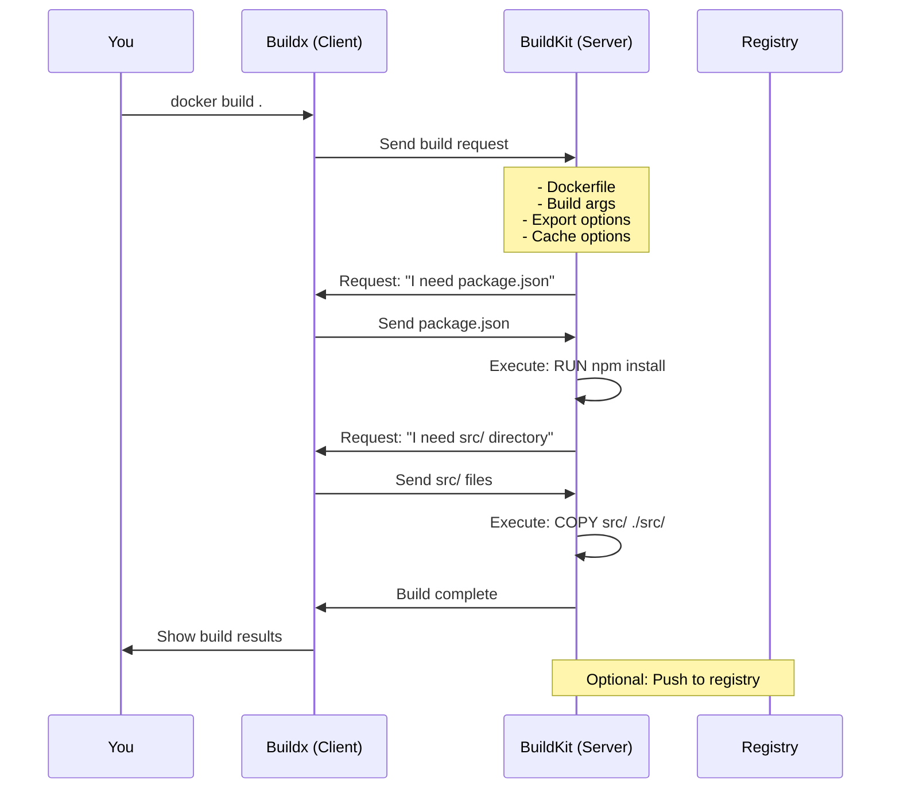

Build request example:
{
  "dockerfile": "FROM node:18\\nWORKDIR /app\\n...",
  "buildArgs": {"NODE_ENV": "production"},
  "exportOptions": {"type": "image", "name": "my-app:latest"},
  "cacheOptions": {"type": "registry", "ref": "my-app:cache"}
}
