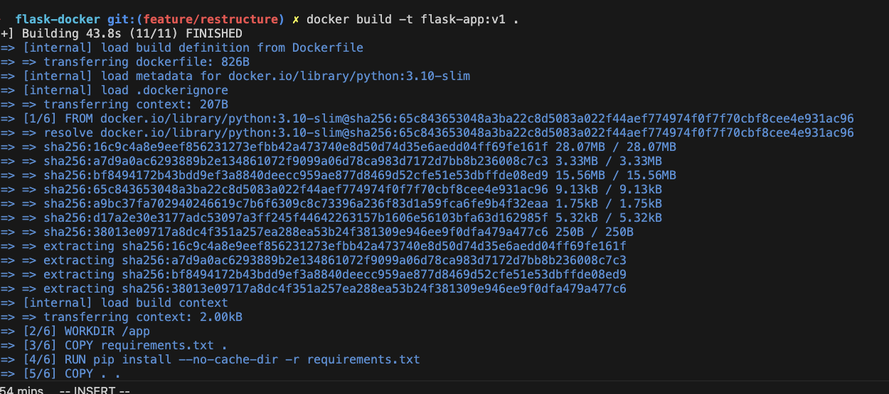
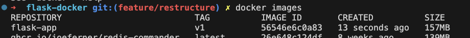
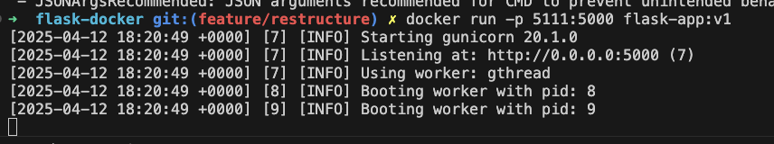
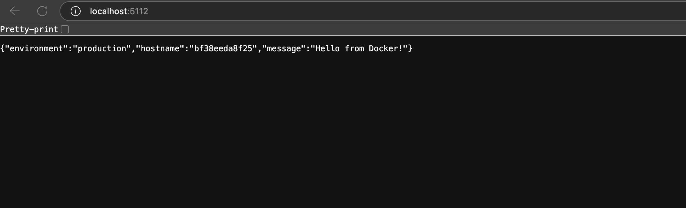
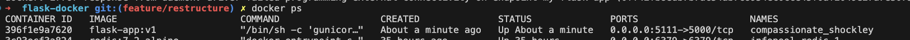
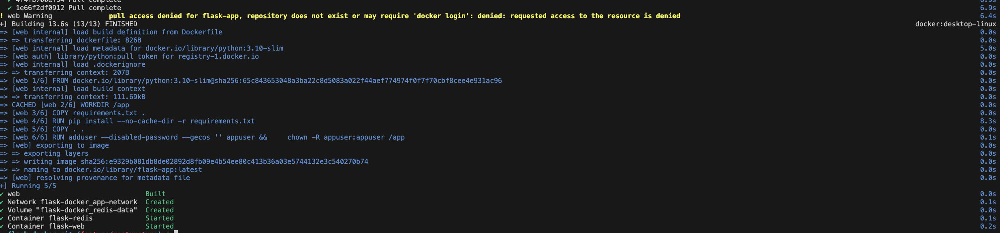
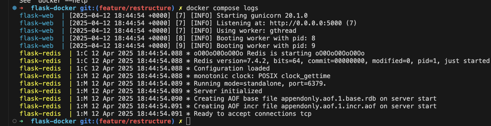
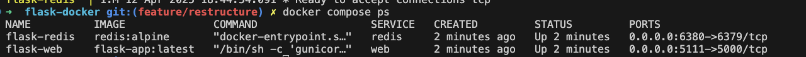

# Containerization with Docker

## Table of Contents
- [Containerization with Docker](#containerization-with-docker)
  - [Table of Contents](#table-of-contents)
  - [Introduction to Docker](#introduction-to-docker)
  - [Prerequisites](#prerequisites)
  - [Setting Up Your Environment](#setting-up-your-environment)
    - [Installing Docker](#installing-docker)
    - [Verifying Installation](#verifying-installation)
  - [Creating a Simple Flask Application](#creating-a-simple-flask-application)
    - [Project Setup](#project-setup)
    - [Creating Application Files](#creating-application-files)
  - [Creating a Dockerfile](#creating-a-dockerfile)
  - [Building and Running Docker Containers](#building-and-running-docker-containers)
    - [Building the Docker Image](#building-the-docker-image)
    - [Running Containers](#running-containers)
      - [Port binding](#port-binding)
    - [Managing Containers](#managing-containers)
  - [Docker Volumes for Persistent Data](#docker-volumes-for-persistent-data)
    - [Types of Volumes](#types-of-volumes)
    - [Working with Volumes](#working-with-volumes)
  - [Docker Compose for Multi-Container Applications](#docker-compose-for-multi-container-applications)
    - [Creating a Docker Compose File](#creating-a-docker-compose-file)
    - [Update the Flask App to Use Redis](#update-the-flask-app-to-use-redis)
    - [Running with Docker Compose](#running-with-docker-compose)
  - [Docker Networking](#docker-networking)
    - [Network Types](#network-types)
    - [Managing Networks](#managing-networks)
    - [Network Configuration in Docker Compose](#network-configuration-in-docker-compose)
  - [Docker Best Practices](#docker-best-practices)
    - [Security](#security)
    - [Image Optimization](#image-optimization)
    - [Example of Multi-Stage Build](#example-of-multi-stage-build)
  - [Debugging Docker Containers](#debugging-docker-containers)
    - [Inspecting Container Details](#inspecting-container-details)
    - [Debugging Tools](#debugging-tools)
    - [Debugging Network Issues](#debugging-network-issues)
  - [Docker in Production](#docker-in-production)
    - [Container Orchestration](#container-orchestration)
    - [Monitoring and Logging](#monitoring-and-logging)
  - [Troubleshooting Common Issues](#troubleshooting-common-issues)
    - [Container Exits Immediately](#container-exits-immediately)
    - [Port Binding Failures](#port-binding-failures)
    - [Volume Permission Problems](#volume-permission-problems)
    - [Container Can't Connect to Network](#container-cant-connect-to-network)

## Introduction to Docker

Docker is an open-source platform that automates the deployment, scaling, and management of applications using containerization. Containers package an application with all its dependencies, libraries, and configuration files, ensuring it runs consistently across different environments.

**Key Concepts:**
- **Container**: A lightweight, standalone executable package that includes everything needed to run an application
- **Image**: A read-only template used to create containers
- **Dockerfile**: A text file with instructions for building a Docker image
- **Registry**: A repository for storing and distributing Docker images
- **Volume**: A mechanism for persisting data generated by containers
- **Docker Compose**: A tool for defining and running multi-container applications

**Benefits of Docker:**
- Consistent environments across development, testing, and production
- Isolation of applications and dependencies
- Efficient resource utilization compared to traditional virtual machines
- Faster deployment and scaling
- Simplified configuration and maintenance

## Prerequisites

Before starting with Docker containerization, ensure you have:

- A computer running Windows, macOS, or Linux
- Administrative or sudo privileges on your machine
- At least 4GB of RAM and 10GB of free disk space
- Internet connection for downloading Docker and images
- Basic understanding of command line operations
- Familiarity with the application you want to containerize

## Setting Up Your Environment

### Installing Docker

**For macOS:**
```bash
# Using Homebrew
brew install docker docker-compose

# Alternatively, download Docker Desktop from https://www.docker.com/products/docker-desktop
```

**For Windows:**
1. Download Docker Desktop from https://www.docker.com/products/docker-desktop
2. Install and follow the wizard instructions
3. Ensure WSL 2 is enabled (for Windows 10/11)

**For Ubuntu:**
```bash
# Update package index
sudo apt-get update

# Install prerequisites
sudo apt-get install apt-transport-https ca-certificates curl software-properties-common

# Add Docker's official GPG key
curl -fsSL https://download.docker.com/linux/ubuntu/gpg | sudo apt-key add -

# Add the Docker repository
sudo add-apt-repository "deb [arch=amd64] https://download.docker.com/linux/ubuntu $(lsb_release -cs) stable"

# Update package index again
sudo apt-get update

# Install Docker CE
sudo apt-get install docker-ce docker-ce-cli containerd.io

# Start and enable Docker service
sudo systemctl start docker
sudo systemctl enable docker

# Add your user to the Docker group to run Docker without sudo
sudo usermod -aG docker $USER
# Log out and back in for changes to take effect
```

### Verifying Installation

```bash
# Check Docker version
docker --version

# Run a test container
docker run hello-world
```

If you see a "Hello from Docker!" message, the installation was successful.

## Creating a Simple Flask Application

We'll create a simple Flask web application as our example for containerization.

### Project Setup

```bash
# Create and navigate to project directory
mkdir flask-docker
cd flask-docker
```

### Creating Application Files

```bash
touch app.py
```

**Create app.py:**
```python
from flask import Flask, jsonify, render_template
import os
import socket

app = Flask(__name__)

@app.route('/')
def hello():
    hostname = socket.gethostname()
    return jsonify({
        "message": "Hello from Docker!",
        "hostname": hostname,
        "environment": os.environ.get("ENVIRONMENT", "development")
    })

@app.route('/health')
def health():
    return jsonify({"status": "ok"})

@app.route('/ui')
def ui():
    hostname = socket.gethostname()
    return render_template('index.html', hostname=hostname)

if __name__ == '__main__':
    port = int(os.environ.get("PORT", 5000))
    app.run(host='0.0.0.0', port=port, debug=os.environ.get("DEBUG", "true").lower() == "true")
```

**Create requirements.txt:**
```bash
touch requirements.txt
```

```
flask==2.2.3
werkzeug==2.2.3
gunicorn==20.1.0

```

**Create templates/index.html:**
```bash
# First create the templates directory
mkdir -p templates
cd templates
touch index.html
```

```html
<!DOCTYPE html>
<html>
<head>
    <title>Docker Flask App</title>
    <style>
        body {
            font-family: Arial, sans-serif;
            margin: 40px;
            line-height: 1.6;
        }
        .container {
            max-width: 800px;
            margin: 0 auto;
            padding: 20px;
            border: 1px solid #ddd;
            border-radius: 5px;
        }
        .info {
            background-color: #f4f4f4;
            padding: 15px;
            border-radius: 5px;
        }
    </style>
</head>
<body>
    <div class="container">
        <h1>Hello from Docker!</h1>
        <div class="info">
            <p>This page is served from container: <strong>{{ hostname }}</strong></p>
        </div>
    </div>
</body>
</html>
```

## Creating a Dockerfile

A Dockerfile contains instructions for building a Docker image. Let's create one for our Flask application:

```bash
touch Dockerfile
```

**Create Dockerfile:**
```dockerfile
# Use an official Python runtime as a parent image
FROM python:3.10-slim

# Set working directory
WORKDIR /app

# Set environment variables
ENV PYTHONDONTWRITEBYTECODE=1 \
    PYTHONUNBUFFERED=1 \
    PORT=5000 \
    ENVIRONMENT=production \
    DEBUG=false

# Copy requirements first for better cache
COPY requirements.txt .

# Install dependencies
RUN pip install --no-cache-dir -r requirements.txt

# Copy the rest of the application
COPY . .

# Create a non-root user and switch to it
RUN adduser --disabled-password --gecos '' appuser && \
    chown -R appuser:appuser /app
USER appuser

# Make port 5000 available
EXPOSE 5000

# Run the application with Gunicorn
CMD gunicorn --bind 0.0.0.0:$PORT --workers 2 --threads 4 --timeout 60 "app:app"
```

**Create .dockerignore file:**

```bash
touch .dockerignore
```

conpy and pase the following:
```
.git
.gitignore
Dockerfile
docker-compose.yml
README.md
__pycache__
*.pyc
*.pyo
*.pyd
.Python
env/
venv/
.env
.venv
data/
*.log
```

## Building and Running Docker Containers

### Building the Docker Image

```bash
# Build the image
docker build -t flask-app:v1 .


# List available images
docker images
```




### Running Containers

**Run in foreground mode:**
```bash
docker run -p 5111:5000 flask-app:v1
```

#### Port binding

The `docker run -p 5111:5000 flask-app:v1` command demonstrates Docker port binding, which creates a mapping between ports on your host machine and ports inside your container.
Let's break down what -p 5111:5000 means:

`5111` is the available port on your host machine (your computer).
`5000` is the port inside the Docker container where your Flask app is running
The colon : separates these two port numbers

So when you run this command, Docker:

Starts a container from the flask-app:v1 image
Sets up networking so that requests to localhost:5111 on your host machine are forwarded to port 5000 inside the container

This port binding allows you to:

Run multiple containers using the same internal port (e.g., 5000) but map them to different host ports
Access your containerized application from your browser or other tools using http://localhost:5111
Keep container ports isolated from each other and your host system

Without this port mapping, the Flask application would still run on port 5000 inside the container, but you wouldn't be able to access it from outside the container.

**Run in detached mode:**
```bash
docker run -d -p 5111:5000 --name my-flask-app flask-app:v1
```



**Run with environment variables:**
```bash
docker run -d -p 5111:5000 \
  -e DEBUG=true \
  -e ENVIRONMENT=development \
  --name my-dev-app flask-app:v1
```

**Open your browser and enter 'localhost:5111'**



### Managing Containers



```bash
# List running containers
docker ps

# List all containers (including stopped)
docker ps -a

# Stop a container
docker stop my-flask-app

# Start a stopped container
docker start my-flask-app

# Remove a container (must be stopped first)
docker rm my-flask-app

# Run and automatically remove when stopped
docker run --rm -p 5111:5000 flask-app:v1

# View container logs
docker logs my-flask-app

# Follow container logs
docker logs -f my-flask-app

# Execute commands inside a running container
docker exec -it my-flask-app /bin/bash
```

## Docker Volumes for Persistent Data

Docker volumes allow you to persist data beyond the lifecycle of a container and share data between containers and the host system.

### Types of Volumes

1. **Named Volumes**: Managed by Docker, stored in a part of the host filesystem
2. **Bind Mounts**: Directly map a host path to a container path
3. **tmpfs Mounts**: Stored in host system's memory only (temporary)

### Working with Volumes

**Create a named volume:**
```bash
docker volume create flask-data
```

**Run a container with a named volume:**
```bash
docker run -d -p 5111:5000 \
  --name flask-with-volume \
  -v flask-data:/app/data \
  flask-app:v1
```

**Run a container with a bind mount:**
```bash
# Create a directory for data
mkdir -p data
echo "This is persistent data" > data/test.txt

# Mount it to the container
docker run -d -p 5112:5000 \
  --name flask-with-bind-mount \
  -v $(pwd)/data:/app/data \
  flask-app:v1
```

**Verify the mounted volume:**
```bash
docker exec -it flask-with-bind-mount /bin/bash
cat /app/data/test.txt
exit
```

**List volumes:**
```bash
docker volume ls
```

**Inspect a volume:**
```bash
docker volume inspect flask-data
```

**Remove a volume:**
```bash
docker volume rm flask-data
```

**Note**: You will need to stop the running comtainer before removing the volume.

## Docker Compose for Multi-Container Applications

Docker Compose simplifies the management of multi-container applications.

### Creating a Docker Compose File

```bash
touch docker-compose.yml
```

**Create docker-compose.yml:**
```yaml
services:
  web:
    build:
      context: .
      dockerfile: Dockerfile
    image: flask-app:latest
    container_name: flask-web
    restart: unless-stopped
    ports:
      - "5000:5000"
    volumes:
      - ./data:/app/data
    environment:
      - PORT=5000
      - DEBUG=true
      - ENVIRONMENT=development
    depends_on:
      - redis
    networks:
      - app-network

  redis:
    image: "redis:alpine"
    container_name: flask-redis
    restart: unless-stopped
    ports:
      - "6379:6379"
    volumes:
      - redis-data:/data
    command: redis-server --appendonly yes
    networks:
      - app-network

networks:
  app-network:
    driver: bridge

volumes:
  redis-data:
```

### Update the Flask App to Use Redis

**Update app.py to use Redis:**
```python
from flask import Flask, jsonify, render_template
import os
import socket
import redis

app = Flask(__name__)

# Connect to Redis (with graceful fallback if not available)
try:
    redis_client = redis.Redis(host=os.environ.get('REDIS_HOST', 'redis'),
                              port=int(os.environ.get('REDIS_PORT', 6379)),
                              db=0,
                              socket_connect_timeout=2,
                              socket_timeout=2)
    redis_connected = True
except:
    redis_connected = False

@app.route('/')
def hello():
    hostname = socket.gethostname()
    counter = 0

    if redis_connected:
        try:
            redis_client.incr('hits')
            counter = int(redis_client.get('hits').decode('utf-8'))
        except:
            redis_connected = False

    return jsonify({
        "message": "Hello from Docker!",
        "hostname": hostname,
        "environment": os.environ.get("ENVIRONMENT", "development"),
        "redis_connected": redis_connected,
        "counter": counter
    })

@app.route('/health')
def health():
    redis_status = "connected" if redis_connected else "disconnected"
    return jsonify({
        "status": "ok",
        "redis": redis_status
    })

@app.route('/ui')
def ui():
    hostname = socket.gethostname()
    counter = 0

    if redis_connected:
        try:
            redis_client.incr('hits')
            counter = int(redis_client.get('hits').decode('utf-8'))
        except:
            pass

    return render_template('index.html',
                           hostname=hostname,
                           counter=counter,
                           redis_connected=redis_connected)

if __name__ == '__main__':
    port = int(os.environ.get("PORT", 5000))
    app.run(host='0.0.0.0', port=port, debug=os.environ.get("DEBUG", "true").lower() == "true")
```

**Update requirements.txt:**

```
flask==2.2.3
werkzeug==2.2.3
gunicorn==20.1.0
redis==4.5.1
```

**Update templates/index.html:**
```html
<!DOCTYPE html>
<html>
<head>
    <title>Docker Flask App</title>
    <style>
        body {
            font-family: Arial, sans-serif;
            margin: 40px;
            line-height: 1.6;
        }
        .container {
            max-width: 800px;
            margin: 0 auto;
            padding: 20px;
            border: 1px solid #ddd;
            border-radius: 5px;
        }
        .info {
            background-color: #f4f4f4;
            padding: 15px;
            border-radius: 5px;
            margin-bottom: 20px;
        }
        .counter {
            font-size: 24px;
            font-weight: bold;
            color: #333;
        }
        .badge {
            display: inline-block;
            padding: 5px 10px;
            border-radius: 20px;
            font-size: 14px;
            font-weight: bold;
        }
        .badge-success {
            background-color: #28a745;
            color: white;
        }
        .badge-danger {
            background-color: #dc3545;
            color: white;
        }
    </style>
</head>
<body>
    <div class="container">
        <h1>Hello from Docker!</h1>
        <div class="info">
            <p>This page is served from container: <strong>{{ hostname }}</strong></p>
            <p>Redis:
                
                <span class="badge badge-success">Connected</span>
                
                <span class="badge badge-danger">Disconnected</span>
                
            </p>
            
            <p>Page views: <span class="counter">{{ counter }}</span></p>
            
        </div>
    </div>
</body>
</html>
```

### Running with Docker Compose

```bash
# Start all services
docker compose up -d
```


```bash
# View logs from all services
docker compose logs
```


```bash
# View logs from a specific service
docker compose logs web

# Follow logs
docker compose logs -f
```

```bash
# Check the status of services
docker compose ps
```


```bash
# Stop all services but keep containers
docker compose stop

# Start services again
docker compose start

# Stop and remove containers, networks, and volumes
docker compose down

# Stop and remove containers, networks, volumes, and images
docker compose down --rmi all --volumes
```

## Docker Networking

Docker provides several network drivers for different use cases.

### Network Types

1. **Bridge**: Default network driver, suitable for standalone containers on a single host
2. **Host**: Removes network isolation, using the host's network directly
3. **Overlay**: Connects multiple Docker daemons, used in Docker Swarm
4. **Macvlan**: Assigns a MAC address to a container, making it appear as a physical device
5. **None**: Disables all networking for a container

### Managing Networks

```bash
# List networks
docker network ls

# Create a network
docker network create my-network

# Inspect a network
docker network inspect my-network

# Connect a running container to a network
docker network connect my-network my-flask-app

# Disconnect a container from a network
docker network disconnect my-network my-flask-app

# Run a container with a specific network
docker run -d --name my-flask-app --network my-network flask-app:v1

# Remove a network
docker network rm my-network
```

### Network Configuration in Docker Compose

```yaml
networks:
  frontend:
    driver: bridge
    ipam:
      driver: default
      config:
        - subnet: 172.28.0.0/16
  backend:
    driver: bridge
```

## Docker Best Practices

### Security

1. **Use specific image versions** rather than the `latest` tag
2. **Scan images for vulnerabilities**:
   ```bash
   docker scan flask-app:v1
   ```
3. **Run containers as non-root users**
4. **Use minimal base images** like alpine or slim variants
5. **Don't store secrets in images** - use environment variables or Docker secrets

### Image Optimization

1. **Use multi-stage builds** to reduce image size
2. **Order your Dockerfile instructions** to take advantage of layer caching
3. **Minimize the number of layers** by combining commands
4. **Clean up in the same layer** where you install packages
5. **Use .dockerignore** to exclude unnecessary files

### Example of Multi-Stage Build

```bash
touch Dockerfile.multi
```

```dockerfile
# Build stage
FROM python:3.10-slim AS builder

WORKDIR /app

COPY requirements.txt .

RUN pip install --user --no-cache-dir -r requirements.txt

# Run stage
FROM python:3.10-slim

WORKDIR /app

COPY --from=builder /root/.local /root/.local
COPY . .

ENV PATH=/root/.local/bin:$PATH
ENV PYTHONDONTWRITEBYTECODE=1 \
    PYTHONUNBUFFERED=1 \
    PORT=5000

# Create a non-root user
RUN adduser --disabled-password --gecos '' appuser && \
    chown -R appuser:appuser /app
USER appuser

EXPOSE 5000

CMD ["gunicorn", "--bind", "0.0.0.0:5000", "app:app"]
```

## Debugging Docker Containers

### Inspecting Container Details

```bash
# View container details
docker inspect my-flask-app

# View container logs
docker logs my-flask-app

# Get specific information using format
docker inspect --format='{{range .NetworkSettings.Networks}}{{.IPAddress}}{{end}}' my-flask-app
```

### Debugging Tools

```bash
# Interactive shell in a running container
docker exec -it my-flask-app /bin/bash

# If bash is not available, try sh
docker exec -it my-flask-app /bin/sh

# Monitor container resource usage
docker stats my-flask-app

# Copy files between container and host
docker cp my-flask-app:/app/logs/app.log ./local-app.log
docker cp ./local-config.json my-flask-app:/app/config.json
```

### Debugging Network Issues

```bash
# Install network tools in a container
docker exec -it my-flask-app /bin/bash
apt-get update && apt-get install -y iputils-ping net-tools curl

# Check connectivity
ping redis
curl http://redis:6379
```

## Docker in Production

### Container Orchestration

For production environments, consider using container orchestration platforms:

1. **Docker Swarm**: Simple built-in orchestration for Docker
2. **Kubernetes**: Powerful, industry-standard container orchestration
3. **Amazon ECS/EKS**: AWS managed container services
4. **Azure AKS**: Microsoft's managed Kubernetes service
5. **Google GKE**: Google's managed Kubernetes service

### Monitoring and Logging

Consider integrating the following tools:

1. **Prometheus**: Monitoring and alerting
2. **Grafana**: Visualization and dashboards
3. **ELK Stack**: Elasticsearch, Logstash, and Kibana for log management
4. **Fluentd/Fluent Bit**: Log collection and forwarding

## Troubleshooting Common Issues

### Container Exits Immediately

**Possible causes and solutions:**
- Application crashes on startup - check logs with `docker logs [container_id]`
- Missing entry point - ensure CMD or ENTRYPOINT is properly defined
- Running a non-daemon process - use `-d` flag to run in detached mode

### Port Binding Failures

**Possible causes and solutions:**
- Port already in use - change the host port mapping
- Permission issues - try running with sudo or add your user to the docker group
- Incorrect port exposure - ensure EXPOSE directive matches your application's port

### Volume Permission Problems

**Solution:**
```bash
# Change ownership of host directory to match container user
sudo chown -R 1000:1000 ./data

# Or adjust permissions on host directory
sudo chmod -R 777 ./data
```

### Container Can't Connect to Network

**Troubleshooting steps:**
1. Check network configuration with `docker network inspect`
2. Ensure containers are on the same network
3. Try using container names instead of IP addresses
4. Verify firewall settings aren't blocking connections
