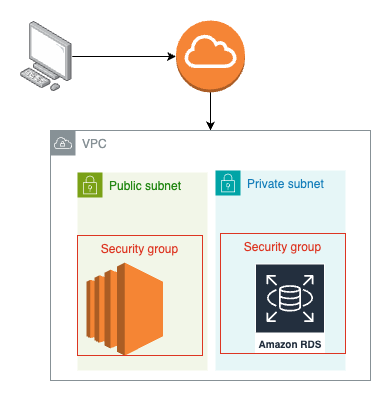
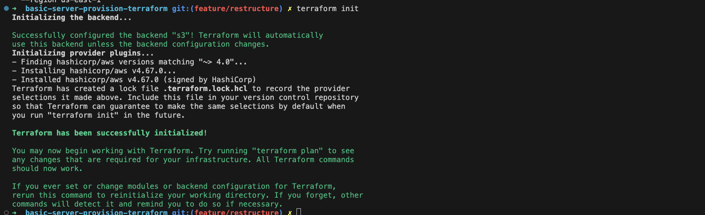
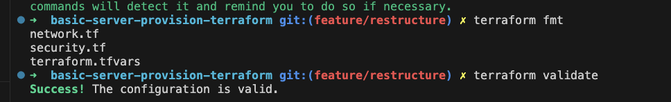
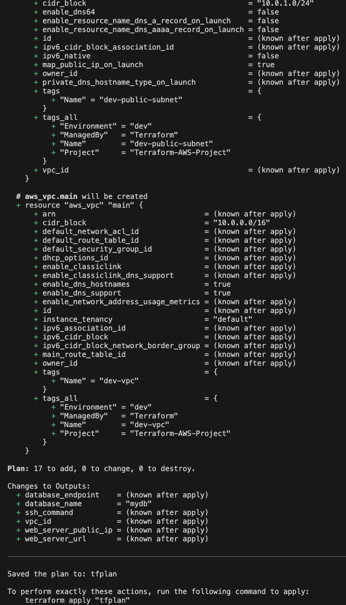
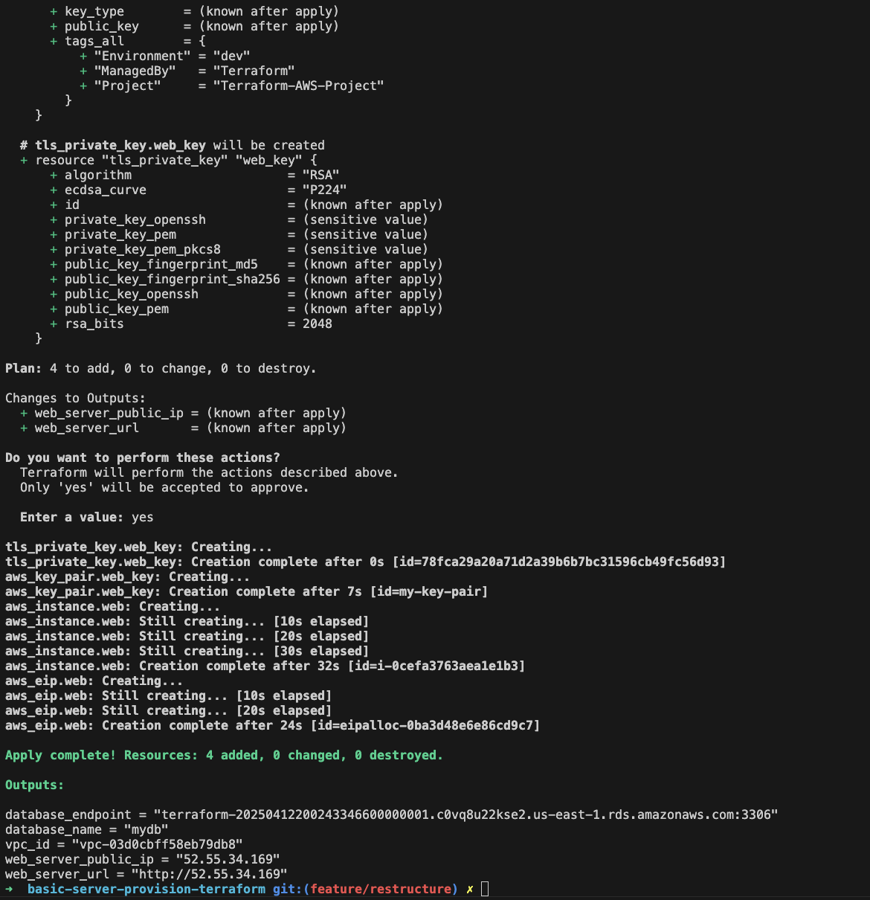
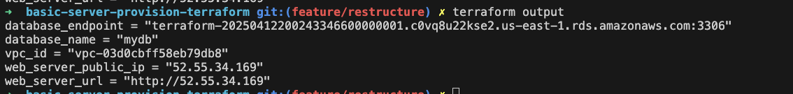
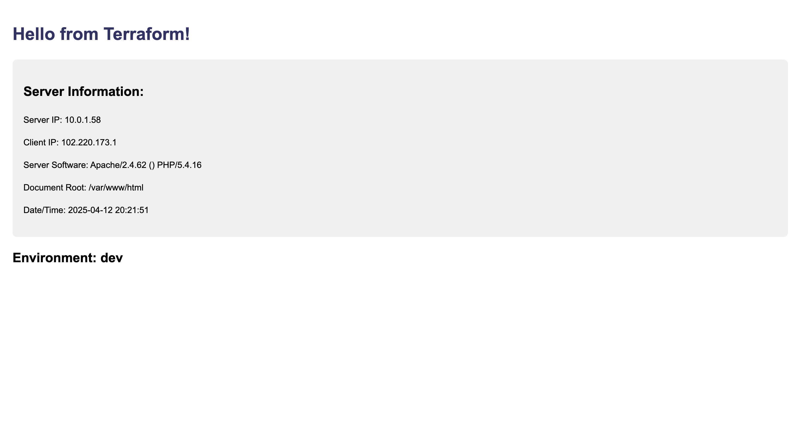
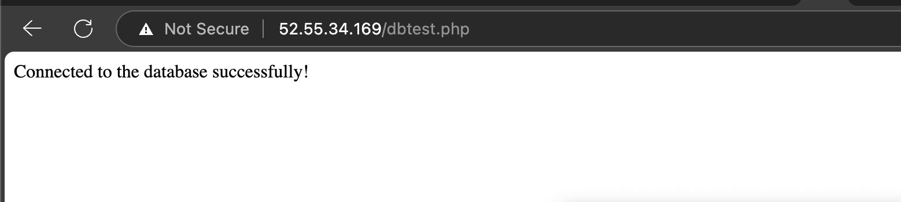
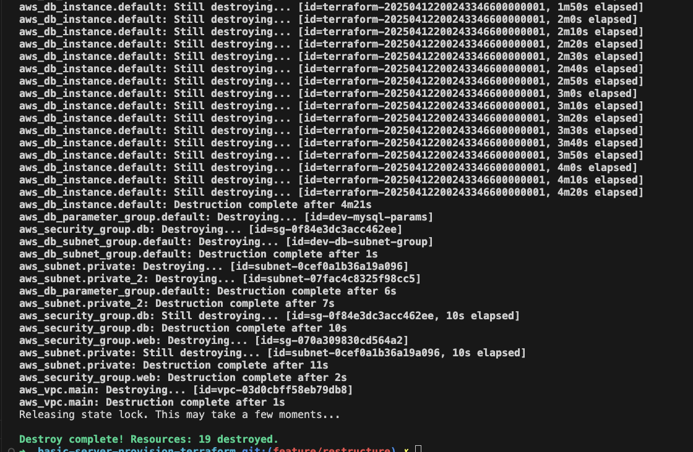

# Building Cloud Infrastructure with Terraform

This guide will walk you through provisioning and managing cloud infrastructure using Infrastructure as Code (IaC) with Terraform. You'll create a complete environment with networking components, web servers, and a database in AWS.



## Table of Contents
- [Building Cloud Infrastructure with Terraform](#building-cloud-infrastructure-with-terraform)
  - [Table of Contents](#table-of-contents)
  - [Introduction to Infrastructure as Code](#introduction-to-infrastructure-as-code)
  - [Prerequisites](#prerequisites)
  - [Project Overview](#project-overview)
  - [Step 1: Setting Up Your Environment](#step-1-setting-up-your-environment)
    - [Create Project Directory](#create-project-directory)
    - [Project Structure](#project-structure)
    - [Create Variables File](#create-variables-file)
    - [Create Terraform Variables File](#create-terraform-variables-file)
  - [Step 2: Understanding the Configuration Files](#step-2-understanding-the-configuration-files)
    - [Provider Configuration (main.tf)](#provider-configuration-maintf)
  - [Step 3: Creating Network Infrastructure](#step-3-creating-network-infrastructure)
    - [Create a network.tf file](#create-a-networktf-file)
  - [Step 4: Implementing Security Groups](#step-4-implementing-security-groups)
    - [Create a security.tf file](#create-a-securitytf-file)
  - [Step 5: Deploying Web Servers](#step-5-deploying-web-servers)
    - [Create a webserver.tf file](#create-a-webservertf-file)
  - [Step 6: Provisioning Database Resources](#step-6-provisioning-database-resources)
    - [Create a database.tf file](#create-a-databasetf-file)
  - [Step 7: Managing Terraform State](#step-7-managing-terraform-state)
    - [Set up S3 backend for state storage](#set-up-s3-backend-for-state-storage)
  - [Step 8: Testing Your Infrastructure](#step-8-testing-your-infrastructure)
    - [Create an outputs.tf file](#create-an-outputstf-file)
    - [Initialize and Apply Terraform](#initialize-and-apply-terraform)
    - [Verify Your Infrastructure](#verify-your-infrastructure)
      - [Empty the S3 bucket](#empty-the-s3-bucket)
      - [Now, delete the S3 bucket](#now-delete-the-s3-bucket)

## Introduction to Infrastructure as Code

Infrastructure as Code (IaC) is the practice of managing infrastructure through machine-readable definition files rather than manual processes. Terraform is an open-source IaC tool that enables you to safely and predictably create, change, and improve infrastructure.

**Benefits of IaC with Terraform:**
- **Version Control**: Track changes to your infrastructure
- **Consistency**: Deploy identical environments every time
- **Automation**: Reduce manual errors and increase deployment speed
- **Documentation**: Your code serves as documentation for your infrastructure
- **Scalability**: Easily replicate infrastructure components

Read more from
[Learn Infrastructure as Code by Building a Custom Machine Image in AWS](https://www.freecodecamp.org/news/learn-instructure-as-a-code-by-building-custom-machine-image-in-aws/)

## Prerequisites

Before starting this project, ensure you have:

1. **AWS Account**: A free tier account or paid account with appropriate permissions
   - If you're new to AWS, sign up at [aws.amazon.com](https://aws.amazon.com)
   - Create an IAM user with programmatic access and appropriate permissions

2. **AWS CLI**: Installed and configured with access credentials
   ```bash
   # Install AWS CLI
   # For macOS:
   brew install awscli

   # For Windows:
   choco install awscli

   # For Linux:
   curl "https://awscli.amazonaws.com/awscli-exe-linux-x86_64.zip" -o "awscliv2.zip"
   unzip awscliv2.zip
   sudo ./aws/install

   # Configure AWS CLI
   aws configure
   # Enter your AWS Access Key ID, Secret Access Key, default region, and output format
   ```

3. **Terraform**: Latest version installed
   ```bash
   # For macOS
   brew install terraform

   # For Windows
   choco install terraform

   # For Linux
   wget https://releases.hashicorp.com/terraform/1.5.0/terraform_1.5.0_linux_amd64.zip
   unzip terraform_1.5.0_linux_amd64.zip
   sudo mv terraform /usr/local/bin/
   ```

4. **SSH Key Pair**: Created in your preferred AWS region
   ```bash
   # Create a key pair in AWS console or using AWS CLI
   aws ec2 create-key-pair --key-name terraform-key --query 'KeyMaterial' --output text > terraform-key.pem
   chmod 400 terraform-key.pem
   ```

## Project Overview

This project will create:
- A Virtual Private Cloud (VPC) with public and private subnets
- Internet Gateway for public internet access
- Route tables and security groups
- An EC2 instance running a web server
- A MySQL RDS database instance
- All necessary interconnections between components

Here's the architecture diagram of what we'll build:

```
                          Internet
                             │
                             ▼
                     ┌─────────────┐
                     │ Internet    │
                     │ Gateway     │
                     └──────┬──────┘
                            │
                  ┌─────────▼───────────┐
                  │                     │
          ┌───────▼─────────┐  ┌────────▼────────┐
          │ Public Subnet   │  │ Private Subnet  │
          │                 │  │                 │
┌─────────▼─────────┐       │  │       ┌─────────▼─────────┐
│ EC2 Web Server    │       │  │       │ RDS Database      │
│ with Security     │       │  │       │ with Security     │
│ Group            │       │  │       │ Group             │
└─────────┬─────────┘       │  │       └─────────┬─────────┘
          │                 │  │                 │
          └─────────────────┘  └─────────────────┘
                   │                    │
                   └────────────────────┘
                            │
                            ▼
                     ┌─────────────┐
                     │     VPC     │
                     └─────────────┘
```

## Step 1: Setting Up Your Environment

### Create Project Directory
```bash
mkdir terraform-aws-project
cd terraform-aws-project
```

### Project Structure
Organize your project with the following structure:
```
terraform-aws-project/
├── main.tf           # Provider configuration and VPC resources
├── variables.tf      # Variable declarations
├── terraform.tfvars  # Variable values (excluded from version control)
├── outputs.tf        # Output definitions
├── network.tf        # VPC, subnets, IGW, route tables
├── security.tf       # Security groups
├── webserver.tf      # EC2 instances and related resources
├── database.tf       # RDS instance and related resources
└── README.md         # Project documentation
```

### Create Variables File
Create a `variables.tf` file to make your configuration more reusable:

```hcl
variable "aws_region" {
  description = "AWS region to deploy resources"
  type        = string
  default     = "us-east-1"
}

variable "vpc_cidr" {
  description = "CIDR block for VPC"
  type        = string
  default     = "10.0.0.0/16"
}

variable "public_subnet_cidr" {
  description = "CIDR block for public subnet"
  type        = string
  default     = "10.0.1.0/24"
}

variable "private_subnet_cidr" {
  description = "CIDR block for private subnet"
  type        = string
  default     = "10.0.2.0/24"
}

variable "availability_zone" {
  description = "Availability Zone for resources"
  type        = string
  default     = "us-east-1a"
}

variable "additional_az" {
  description = "Additional Availability Zone for RDS"
  type        = string
  default     = "us-east-1b"
}

variable "instance_type" {
  description = "EC2 instance type"
  type        = string
  default     = "t2.micro"
}

variable "db_instance_class" {
  description = "RDS instance class"
  type        = string
  default     = "db.t2.micro"
}

variable "db_name" {
  description = "Database name"
  type        = string
  default     = "mydb"
}

variable "db_username" {
  description = "Database admin username"
  type        = string
  default     = "admin"
}

variable "db_password" {
  description = "Database admin password"
  type        = string
  default     = "password123"
  sensitive   = true
}

variable "environment" {
  description = "Environment name (e.g., dev, test, prod)"
  type        = string
  default     = "dev"
}
```

### Create Terraform Variables File
Create a `terraform.tfvars` file to set your specific values:

```hcl
aws_region           = "us-east-1"
vpc_cidr             = "10.0.0.0/16"
public_subnet_cidr   = "10.0.1.0/24"
private_subnet_cidr  = "10.0.2.0/24"
availability_zone    = "us-east-1a"
additional_az        = "us-east-1b"
instance_type        = "t2.micro"
db_instance_class    = "db.t2.micro"
db_name              = "mydb"
db_username          = "admin"
db_password          = "YourSecurePassword123!"  # Use a strong password
environment          = "dev"
```

**Important**: Add `terraform.tfvars` to your `.gitignore` file to avoid committing sensitive information.

## Step 2: Understanding the Configuration Files

### Provider Configuration (main.tf)
Create a `main.tf` file with the AWS provider configuration:

```hcl
terraform {
  required_providers {
    aws = {
      source  = "hashicorp/aws"
      version = "~> 4.0"
    }
  }

  required_version = ">= 1.0.0"
}

provider "aws" {
  region = var.aws_region

  default_tags {
    tags = {
      Project     = "Terraform-AWS-Project"
      Environment = var.environment
      ManagedBy   = "Terraform"
    }
  }
}
```

## Step 3: Creating Network Infrastructure

### Create a network.tf file

```hcl
# Create a VPC
resource "aws_vpc" "main" {
  cidr_block           = var.vpc_cidr
  enable_dns_hostnames = true
  enable_dns_support   = true

  tags = {
    Name = "${var.environment}-vpc"
  }
}

# Create public subnet
resource "aws_subnet" "public" {
  vpc_id                  = aws_vpc.main.id
  cidr_block              = var.public_subnet_cidr
  availability_zone       = var.availability_zone
  map_public_ip_on_launch = true

  tags = {
    Name = "${var.environment}-public-subnet"
  }
}

# Create private subnet
resource "aws_subnet" "private" {
  vpc_id            = aws_vpc.main.id
  cidr_block        = var.private_subnet_cidr
  availability_zone = var.availability_zone

  tags = {
    Name = "${var.environment}-private-subnet"
  }
}

# Create additional private subnet for RDS (in different AZ)
resource "aws_subnet" "private_2" {
  vpc_id            = aws_vpc.main.id
  cidr_block        = "10.0.3.0/24"  # Use a different CIDR block
  availability_zone = var.additional_az

  tags = {
    Name = "${var.environment}-private-subnet-2"
  }
}

# Create internet gateway
resource "aws_internet_gateway" "gw" {
  vpc_id = aws_vpc.main.id

  tags = {
    Name = "${var.environment}-igw"
  }
}

# Create route table for public subnet
resource "aws_route_table" "public" {
  vpc_id = aws_vpc.main.id

  route {
    cidr_block = "0.0.0.0/0"
    gateway_id = aws_internet_gateway.gw.id
  }

  tags = {
    Name = "${var.environment}-public-rt"
  }
}

# Associate route table with public subnet
resource "aws_route_table_association" "public" {
  subnet_id      = aws_subnet.public.id
  route_table_id = aws_route_table.public.id
}

# Create route table for private subnet
resource "aws_route_table" "private" {
  vpc_id = aws_vpc.main.id

  tags = {
    Name = "${var.environment}-private-rt"
  }
}

# Associate route table with private subnet
resource "aws_route_table_association" "private" {
  subnet_id      = aws_subnet.private.id
  route_table_id = aws_route_table.private.id
}

# Associate route table with second private subnet
resource "aws_route_table_association" "private_2" {
  subnet_id      = aws_subnet.private_2.id
  route_table_id = aws_route_table.private.id
}
```

## Step 4: Implementing Security Groups

### Create a security.tf file

```hcl
# Create security group for web server
resource "aws_security_group" "web" {
  name        = "${var.environment}-web-sg"
  description = "Allow web and SSH traffic"
  vpc_id      = aws_vpc.main.id

  ingress {
    from_port   = 80
    to_port     = 80
    protocol    = "tcp"
    cidr_blocks = ["0.0.0.0/0"]
    description = "Allow HTTP traffic"
  }

  ingress {
    from_port   = 443
    to_port     = 443
    protocol    = "tcp"
    cidr_blocks = ["0.0.0.0/0"]
    description = "Allow HTTPS traffic"
  }

  ingress {
    from_port   = 22
    to_port     = 22
    protocol    = "tcp"
    cidr_blocks = ["0.0.0.0/0"]  # In production, restrict this to your IP
    description = "Allow SSH access"
  }

  egress {
    from_port   = 0
    to_port     = 0
    protocol    = "-1"
    cidr_blocks = ["0.0.0.0/0"]
    description = "Allow all outbound traffic"
  }

  tags = {
    Name = "${var.environment}-web-sg"
  }

  lifecycle {
    create_before_destroy = true
  }
}

# Create security group for database
resource "aws_security_group" "db" {
  name        = "${var.environment}-db-sg"
  description = "Allow database traffic from web servers"
  vpc_id      = aws_vpc.main.id

  ingress {
    from_port       = 3306
    to_port         = 3306
    protocol        = "tcp"
    security_groups = [aws_security_group.web.id]
    description     = "Allow MySQL traffic from web servers"
  }

  egress {
    from_port   = 0
    to_port     = 0
    protocol    = "-1"
    cidr_blocks = ["0.0.0.0/0"]
    description = "Allow all outbound traffic"
  }

  tags = {
    Name = "${var.environment}-db-sg"
  }

  lifecycle {
    create_before_destroy = true
  }
}
```

## Step 5: Deploying Web Servers

### Create a webserver.tf file

```hcl
# Get the latest Amazon Linux 2 AMI
data "aws_ami" "amazon_linux" {
  most_recent = true
  owners      = ["amazon"]

  filter {
    name   = "name"
    values = ["amzn2-ami-hvm-*-x86_64-gp2"]
  }

  filter {
    name   = "virtualization-type"
    values = ["hvm"]
  }
}

# Create key-pair for web server
resource "aws_key_pair" "web_key" {
  key_name   = "my-key-pair"
  public_key = tls_private_key.web_key.public_key_openssh
}

resource "tls_private_key" "web_key" {
  algorithm = "RSA"
  rsa_bits  = 2048
}

# Create EC2 instance for web server
resource "aws_instance" "web" {
  ami                    = data.aws_ami.amazon_linux.id
  instance_type          = var.instance_type
  subnet_id              = aws_subnet.public.id
  vpc_security_group_ids = [aws_security_group.web.id]
  key_name               = aws_key_pair.web_key.key_name

  user_data = <<-EOF
    #!/bin/bash
    # Update system packages
    yum update -y

    # Install Apache web server and PHP
    yum install -y httpd mysql php php-mysql

    # Start and enable Apache
    systemctl start httpd
    systemctl enable httpd

    # Create a simple info page
    cat > /var/www/html/index.php << 'HEREDOC'
    <!DOCTYPE html>
    <html>
    <head>
      <title>Terraform AWS Project</title>
      <style>
        body {
          font-family: Arial, sans-serif;
          margin: 40px;
          line-height: 1.6;
        }
        h1 {
          color: #333366;
        }
        .info {
          background-color: #f0f0f0;
          padding: 20px;
          border-radius: 8px;
        }
      </style>
    </head>
    <body>
      <h1>Hello from Terraform!</h1>
      <div class="info">
        <h2>Server Information:</h2>
        <p>Server IP: <?php echo $_SERVER['SERVER_ADDR']; ?></p>
        <p>Client IP: <?php echo $_SERVER['REMOTE_ADDR']; ?></p>
        <p>Server Software: <?php echo $_SERVER['SERVER_SOFTWARE']; ?></p>
        <p>Document Root: <?php echo $_SERVER['DOCUMENT_ROOT']; ?></p>
        <p>Date/Time: <?php echo date('Y-m-d H:i:s'); ?></p>
      </div>
      <h2>Environment: ${var.environment}</h2>
    </body>
    </html>
    HEREDOC

    # Set proper permissions
    chown apache:apache /var/www/html/index.php

    # Create a test connection file
    cat > /var/www/html/dbtest.php << 'HEREDOC'
    <?php
    $host = '${aws_db_instance.default.address}';
    $username = '${var.db_username}';
    $password = '${var.db_password}';
    $database = '${var.db_name}';

    try {
      $conn = new PDO("mysql:host=$host;dbname=$database", $username, $password);
      $conn->setAttribute(PDO::ATTR_ERRMODE, PDO::ERRMODE_EXCEPTION);
      echo "Connected to the database successfully!";
    } catch(PDOException $e) {
      echo "Connection failed: " . $e->getMessage();
    }
    ?>
    HEREDOC

    # Set proper permissions
    chown apache:apache /var/www/html/dbtest.php
  EOF

  root_block_device {
    volume_size = 10
    volume_type = "gp2"
    encrypted   = true

    tags = {
      Name = "${var.environment}-web-server-volume"
    }
  }

  tags = {
    Name = "${var.environment}-web-server"
  }

  depends_on = [aws_db_instance.default]
}

# Create Elastic IP for web server
resource "aws_eip" "web" {
  instance = aws_instance.web.id
  vpc      = true

  tags = {
    Name = "${var.environment}-web-eip"
  }
}


```

## Step 6: Provisioning Database Resources

### Create a database.tf file

```hcl
# Create DB subnet group
resource "aws_db_subnet_group" "default" {
  name       = "${var.environment}-db-subnet-group"
  subnet_ids = [aws_subnet.private.id, aws_subnet.private_2.id]

  tags = {
    Name = "${var.environment}-db-subnet-group"
  }
}

# Create RDS parameter group
resource "aws_db_parameter_group" "default" {
  name   = "${var.environment}-mysql-params"
  family = "mysql8.0"

  parameter {
    name  = "character_set_server"
    value = "utf8"
  }

  parameter {
    name  = "character_set_client"
    value = "utf8"
  }

  tags = {
    Name = "${var.environment}-mysql-params"
  }
}

# Create RDS instance
```hcl
  resource "aws_db_instance" "default" {
    allocated_storage       = 10
    storage_type            = "gp2"
    engine                  = "mysql"
    engine_version          = "8.0"
    instance_class          = "db.t3.micro"  # Change from db.t2.micro to db.t3.micro
    db_name                 = var.db_name
    username                = var.db_username
    password                = var.db_password
    parameter_group_name    = aws_db_parameter_group.default.name
    db_subnet_group_name    = aws_db_subnet_group.default.name
    vpc_security_group_ids  = [aws_security_group.db.id]
    multi_az                = false
    backup_retention_period = 7
    backup_window           = "03:00-04:00"
    maintenance_window      = "mon:04:00-mon:05:00"
    skip_final_snapshot     = true
    storage_encrypted       = false

    tags = {
      Name = "${var.environment}-mysql-rds"
    }
  }

```

## Step 7: Managing Terraform State

By default, Terraform stores state locally, but for team environments, it's better to use remote state storage.

### Set up S3 backend for state storage
Create a new file called `backend.tf`:

```hcl
terraform {
  backend "s3" {
    bucket         = "your-terraform-state-bucket"
    key            = "terraform-aws-project/terraform.tfstate"
    region         = "us-east-1"
    encrypt        = true
    dynamodb_table = "terraform-state-lock"
  }
}
```

Before applying this configuration, you need to create the S3 bucket and DynamoDB table:

```bash
# Create S3 bucket
aws s3api create-bucket --bucket your-terraform-state-bucket --region us-east-1

# Enable versioning
aws s3api put-bucket-versioning --bucket your-terraform-state-bucket --versioning-configuration Status=Enabled

# Create DynamoDB table for state locking
aws dynamodb create-table \
  --table-name terraform-state-lock \
  --attribute-definitions AttributeName=LockID,AttributeType=S \
  --key-schema AttributeName=LockID,KeyType=HASH \
  --billing-mode PAY_PER_REQUEST \
  --region us-east-1
```

## Step 8: Testing Your Infrastructure

### Create an outputs.tf file
```hcl
output "vpc_id" {
  description = "ID of the VPC"
  value       = aws_vpc.main.id
}

output "web_server_public_ip" {
  description = "Public IP address of the web server"
  value       = aws_eip.web.public_ip
}

output "web_server_url" {
  description = "URL to access the web server"
  value       = "http://${aws_eip.web.public_ip}"
}

output "database_endpoint" {
  description = "Endpoint of the RDS instance"
  value       = aws_db_instance.default.endpoint
}

output "database_name" {
  description = "Name of the database"
  value       = aws_db_instance.default.db_name
}

output "private_key" {
  value = tls_private_key.web_key.private_key_pem
  sensitive = true
}

```

### Initialize and Apply Terraform
```bash
# Initialize Terraform with your configuration
terraform init
```



```bash
# Format your configuration files
terraform fmt

# Validate your configuration
terraform validate
```


```bash
# Plan your infrastructure changes
terraform plan -out=tfplan

```



```bash
# Apply your infrastructure changes
terraform apply tfplan
```



### Verify Your Infrastructure

1. **Check Terraform outputs**:
```bash
  terraform output
```



2. **Access the web server**:
  - Open your web browser and navigate to the web server URL shown in the outputs.
  - You should see the "Hello from Terraform!" page with server information.



3. **Test database connectivity**:
- Navigate to `http://<web_server_ip>/dbtest.php` to check if the web server can connect to the database.



4. **SSH into the instance** (optional):
```bash
  ssh -i your-key-pair.pem ec2-user@<web_server_public_ip>
```

5. **Clean up resources**:

When you're done with the project:

```bash
  terraform destroy
```



Type yes when prompted to confirm the destruction of all resources.

6. **Delete S3 Bucket**

To delete an S3 bucket, you need to ensure that the bucket is empty (as S3 doesn’t allow you to delete non-empty buckets). You can either use the AWS CLI to empty the bucket or manually delete the objects.

#### Empty the S3 bucket

```bash
aws s3 rm s3://your-terraform-state-bucket --recursive
```

#### Now, delete the S3 bucket

```bash
aws s3api delete-bucket --bucket your-terraform-state-bucket --region us-east-1
```

7. **Delete DynamoDB Table**

To delete the DynamoDB table for state locking, use the following AWS CLI command:

```bash
# Delete the DynamoDB table
aws dynamodb delete-table --table-name terraform-state-lock --region us-east-1
```
