# Working with Bitnami WordPress Helm Chart

This README provides a comprehensive guide to working with the Bitnami WordPress Helm chart, with a focus on learning Helm commands and concepts. This guide will take you through the entire process from understanding Helm architecture to deploying and managing WordPress on Kubernetes.

## Prerequisites

- Docker installed and running
- Git (optional, for cloning repositories)
- Command-line tools:
  - `kind` - Kubernetes in Docker
  - `kubectl` - Kubernetes command-line tool
  - `helm` - Kubernetes package manager (v3.x)


## What is Helm?

Helm is the package manager for Kubernetes. It uses a packaging format called charts - a collection of files that describe a related set of Kubernetes resources. Helm charts help you define, install, and upgrade complex Kubernetes applications.

### Helm Architecture

Helm follows a client-only architecture (since Helm 3) which now communicates directly with the k8 API server. Helm consisting of these main components:

1. **Helm Client**: The command-line client that interacts with the Kubernetes API server
2. **Charts**: Packages of pre-configured Kubernetes resources
3. **Releases**: Instances of charts running in the cluster

```
┌────────────────┐     ┌─────────────────┐     ┌─────────────────┐
│                │     │                 │     │                 │
│   Helm Client  │────▶│  Kubernetes API │────▶│ Kubernetes      │
│                │     │                 │     │ Cluster         │
└────────────────┘     └─────────────────┘     └─────────────────┘
        │                                              ▲
        │                                              │
        │            ┌─────────────────┐               │
        │            │                 │               │
        └───────────▶│  Helm Charts    │───────────────┘
                     │                 │
                     └─────────────────┘
```

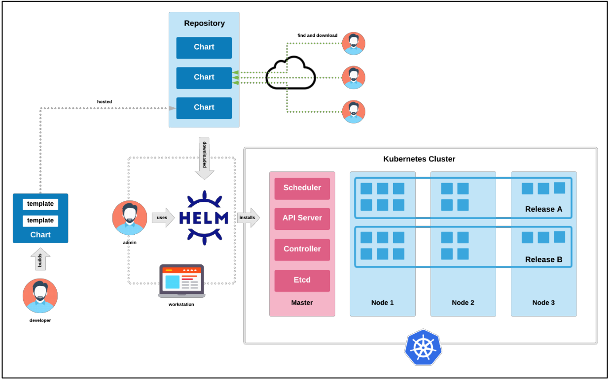

### Chart Structure

A Helm chart has a specific directory structure:

```
wordpress/
  ├── Chart.yaml          # Metadata about the chart
  ├── values.yaml         # Default configuration values
  ├── values.schema.json  # Schema for validating values.yaml
  ├── charts/             # Directory containing dependency charts
  ├── templates/          # Directory of templates that generate Kubernetes manifests
  │   ├── deployment.yaml
  │   ├── service.yaml
  │   ├── ingress.yaml
  │   └── _helpers.tpl    # Template helpers
  ├── templates/NOTES.txt # Usage notes displayed after installation
  └── README.md           # Documentation
```

### Installing Helm

If you haven't installed Helm yet:

```bash
# For macOS (using Homebrew)
brew install helm

# For Windows (using Chocolatey)
choco install kubernetes-helm

# For Linux
curl https://raw.githubusercontent.com/helm/helm/main/scripts/get-helm-3 | bash
```

### Verifying Helm Installation

After installing Helm, verify it's working correctly:

```bash
helm version
```

You should see output similar to:

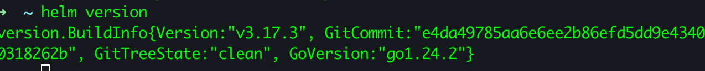

This confirms Helm is installed and ready to use.

## Core Helm Concepts

Understanding these concepts will help you work with Helm charts effectively:

### Chart
A package of pre-configured Kubernetes resources, it is the package format used by Helm. Think of it as a bundle of YAML files that define all the Kubernetes objects needed for an application. Charts are compressed into a single archive file when packaged, which then are often hosted within a chart repository.

### Repository
A place where charts are stored and shared. Similar to Docker Hub for Docker images or npm for JavaScript packages.

### Release
An instance of a chart running in a Kubernetes cluster. When you install a chart, Helm creates a release. Each release has a unique name within a namespace. When you deploy a chart into a cluster, Helm creates a release for it. Releases can be upgraded, rolled back, and even deleted. A release maintains a history of change, with every change being its own revision.

### Values
Configuration that can be supplied to customize a chart. Values are merged with the chart's templates to create the final Kubernetes manifests.

### Templating
Helm uses Go templating to generate Kubernetes manifests. Templates allow dynamic generation of manifests based on supplied values. By taking a typical Kubernetes manifest file and abstracting it into a template, you can parametrize it, such that at chart installation time you can then pass in specific values that alter the behavior of the deployed resource. This is useful for deployments that need to take place in multiple environments, say dev, test, prod, etc.

### Hooks
Special templates in a chart that allow actions at different stages of the release lifecycle (e.g., pre-install, post-install).

### Workflow Diagram

```
┌──────────────────┐  add   ┌────────────────────┐
│                  │───────▶│                    │
│  Helm Repository │        │  Local Repository  │
│                  │◀───────│                    │
└──────────────────┘ update └────────────────────┘
                                      │
                                      │ pull/fetch
                                      ▼
┌──────────────────┐  reference  ┌────────────────────┐
│                  │◀────────────│                    │
│   values.yaml    │             │    Chart Files     │
│                  │────────────▶│                    │
└──────────────────┘    merge    └────────────────────┘
                                      │
                                      │ template
                                      ▼
┌──────────────────┐            ┌────────────────────┐
│                  │            │                    │
│  Kubernetes API  │◀───────────│  K8s Manifests     │
│                  │   apply    │                    │
└──────────────────┘            └────────────────────┘
        │
        │ create/update
        ▼
┌──────────────────┐
│                  │
│  Helm Release    │
│                  │
└──────────────────┘
```

## Working with Helm Repositories

Helm repositories are collections of packaged charts. The Bitnami repository contains hundreds of charts for common applications, including WordPress.

### Adding the Bitnami Repository

```bash
helm repo add bitnami https://charts.bitnami.com/bitnami
```

This command:
1. Adds the Bitnami repository with the name "bitnami"
2. Sets the URL where the repository's index file and charts are located
3. Downloads the repository index file to your local cache

### Updating Repositories

Repositories can update their chart offerings over time. To get the latest charts:

```bash
helm repo update
```

This synchronizes your local cache with the remote repositories.

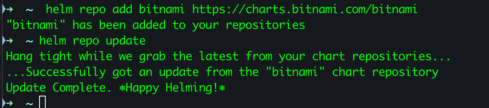

### Searching for Charts

To find WordPress in the Bitnami repository:

```bash
helm search repo bitnami/wordpress
```

output:

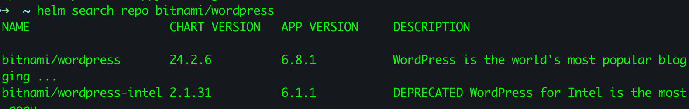

For a more detailed search:
```bash
helm search repo bitnami/wordpress --versions --max-col-width=0
```

This shows all available versions of the chart.

### Listing All Available Charts

To see all charts in the Bitnami repository:

```bash
helm search repo bitnami
```

### Managing Repositories

List all configured repositories:
```bash
helm repo list
```

Remove a repository:
```bash
helm repo remove bitnami
```

### Repository Workflow

```
┌─────────────────┐      ┌─────────────────┐      ┌─────────────────┐
│                 │      │                 │      │                 │
│  Helm Client    │──┬──▶│  Remote Repo    │──┬──▶│  Chart Archive  │
│                 │  │   │                 │  │   │                 │
└─────────────────┘  │   └─────────────────┘  │   └─────────────────┘
        ▲            │             │          │            │
        │            │             │          │            │
        │            │             ▼          │            ▼
┌─────────────────┐  │   ┌─────────────────┐  │   ┌─────────────────┐
│                 │  │   │                 │  │   │                 │
│  Helm Commands  │  │   │  Index.yaml     │  │   │  Extracted      │
│                 │  │   │                 │  │   │  Chart Files    │
└─────────────────┘  │   └─────────────────┘  │   └─────────────────┘
        ▲            │             ▲          │
        │            │             │          │
        │            │             │          │
┌─────────────────┐  │   ┌─────────────────┐  │
│                 │  │   │                 │  │
│  Local Config   │◀─┘   │  Local Cache    │◀─┘
│                 │      │                 │
└─────────────────┘      └─────────────────┘
```

## Exploring Chart Details

Before installing a chart, it's good practice to explore its structure, documentation, and default values to understand what you're deploying.

### Getting Chart Information

View detailed information about the WordPress chart:

```bash
helm show chart bitnami/wordpress
```

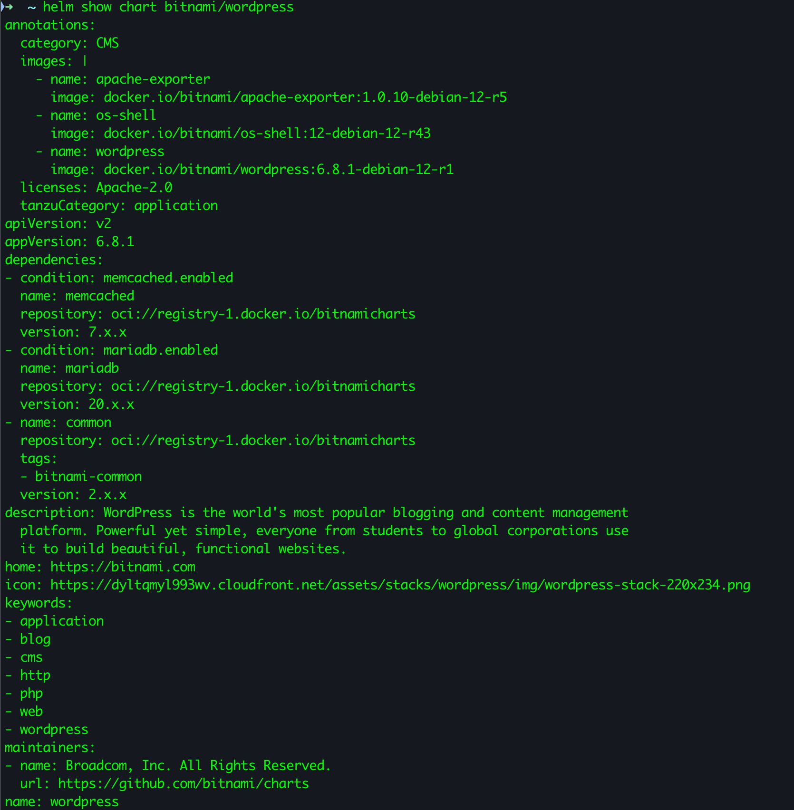

This displays metadata from the Chart.yaml file, including:
- Chart name and version
- App version (WordPress version)
- Dependencies
- Maintainers
- Keywords

### Viewing Chart Documentation

```bash
helm show readme bitnami/wordpress
```

This displays the README.md file from the chart, which typically includes:
- General information about the chart
- Prerequisites
- Installing the chart
- Configuration parameters
- Persistence considerations
- Upgrading instructions

### Examining Default Values

View the default configuration values for the chart:

```bash
helm show values bitnami/wordpress
```

This outputs the contents of the values.yaml file, which can be quite long for complex charts like WordPress.

To save these values to a file for reference and modification:

```bash
helm show values bitnami/wordpress > wordpress-default-values.yaml
```

### Pulling a Chart Locally

To download and extract the chart to your local filesystem for inspection:

```bash
helm pull bitnami/wordpress --untar
```

This creates a wordpress directory containing all chart files, which you can explore:

```bash
ls -la wordpress/
```

This will show you the chart's structure, including the Chart.yaml, values.yaml, and templates directory in a tree format.

```bash
tree wordpress/
```

### Chart Structure Visualization

```
bitnami/wordpress chart
┌────────────────────────────────────────────────────────────┐
│                                                            │
│  Chart.yaml                                                │
│  ┌──────────────────────────────────────────────────────┐  │
│  │ name: wordpress                                      │  │
│  │ version: 16.1.23                                     │  │
│  │ appVersion: 6.3.1                                    │  │
│  │ dependencies:                                        │  │
│  │   - name: mariadb                                    │  │
│  │     version: 11.x.x                                  │  │
│  │   ...                                                │  │
│  └──────────────────────────────────────────────────────┘  │
│                                                            │
│  values.yaml                                               │
│  ┌──────────────────────────────────────────────────────┐  │
│  │ wordpressUsername: user                              │  │
│  │ wordpressPassword: ""                                │  │
│  │ ...                                                  │  │
│  └──────────────────────────────────────────────────────┘  │
│                                                            │
│  templates/                                                │
│  ┌──────────────────────────────────────────────────────┐  │
│  │ ├── deployment.yaml                                  │  │
│  │ ├── service.yaml                                     │  │
│  │ ├── ingress.yaml                                     │  │
│  │ ├── configmap.yaml                                   │  │
│  │ ├── secrets.yaml                                     │  │
│  │ └── _helpers.tpl                                     │  │
│  └──────────────────────────────────────────────────────┘  │
│                                                            │
│  charts/                                                   │
│  ┌──────────────────────────────────────────────────────┐  │
│  │ ├── mariadb/                                         │  │
│  │ │   ├── Chart.yaml                                   │  │
│  │ │   ├── values.yaml                                  │  │
│  │ │   └── templates/                                   │  │
│  │ │       ├── primary-statefulset.yaml                 │  │
│  │ │       ├── primary-service.yaml                     │  │
│  │ │       └── ...                                      │  │
│  │ └── common/                                          │  │
│  │     ├── Chart.yaml                                   │  │
│  │     └── templates/                                   │  │
│  │         └── _*.tpl                                   │  │
│  └──────────────────────────────────────────────────────┘  │
│                                                            │
└────────────────────────────────────────────────────────────┘
```

## Customizing Chart Installation

The real power of Helm comes from its ability to customize charts to fit your needs through values files.

### Understanding Values Files

Values files are YAML files containing configuration that override the chart's default values. This allows you to customize your WordPress installation without modifying the chart itself.

### Key WordPress Configuration Parameters

The Bitnami WordPress chart has many configurable parameters, including:

| Parameter                | Description                                      | Default                            |
|--------------------------|--------------------------------------------------|-----------------------------------|
| `wordpressUsername`      | WordPress admin user                             | `user`                             |
| `wordpressPassword`      | WordPress admin password                         | _random string_                    |
| `wordpressBlogName`      | WordPress blog name                              | `User's Blog!`                     |
| `service.type`           | Kubernetes Service type                          | `LoadBalancer`                     |
| `persistence.size`       | PVC Storage Request for WordPress volume         | `10Gi`                             |
| `mariadb.enabled`        | Whether to use the MariaDB chart                 | `true`                             |
| `externalDatabase.host`  | Host of the external database                    | `""`                               |
| `ingress.enabled`        | Enable ingress controller resource               | `false`                            |
| `resources.limits`       | The resources limits for containers              | `{}`                               |

### Creating a Custom Values File

Create a file named `my-values.yaml` with your custom configuration:

```bash
touch my-values.yaml
```

Copy and paste the following example configuration into `my-values.yaml`, modifying as needed:

```yaml

# Basic WordPress settings
wordpressUsername: admin
wordpressPassword: my-password
wordpressEmail: user@example.com
wordpressBlogName: "My WordPress Site"

# Service configuration
service:
  type: NodePort # By default, LoadBalancer is used which exposes the service externally but this is not available by default in kind
  nodePorts:
    http: 30080
    https: 30443

# Ingress configuration
ingress:
  enabled: true
  hostname: wordpress.local
  ingressClassName: nginx
  pathType: Prefix
  path: /

# Persistence settings
persistence:
  size: 10Gi

# Resource limits
resources:
  limits:
    cpu: 500m
    memory: 512Mi
  requests:
    cpu: 300m
    memory: 256Mi

# Security context
securityContext:
  enabled: true
  runAsUser: 1001
  fsGroup: 1001

```

### Values Hierarchy and Precedence

When installing a chart, values are merged in this order (highest precedence last):
1. Default values from the chart's `values.yaml`
2. Parent chart's values (if this is a subchart)
3. User-supplied values file(s) (`-f` or `--values`)
4. Values passed via `--set` parameters

### Validating Custom Values

Before installing, you can template the chart with your values to see what will be generated:

```bash
helm template wordpress bitnami/wordpress -f my-values.yaml
```

This outputs all the Kubernetes manifests that would be applied, but doesn't install anything.

Sample output:
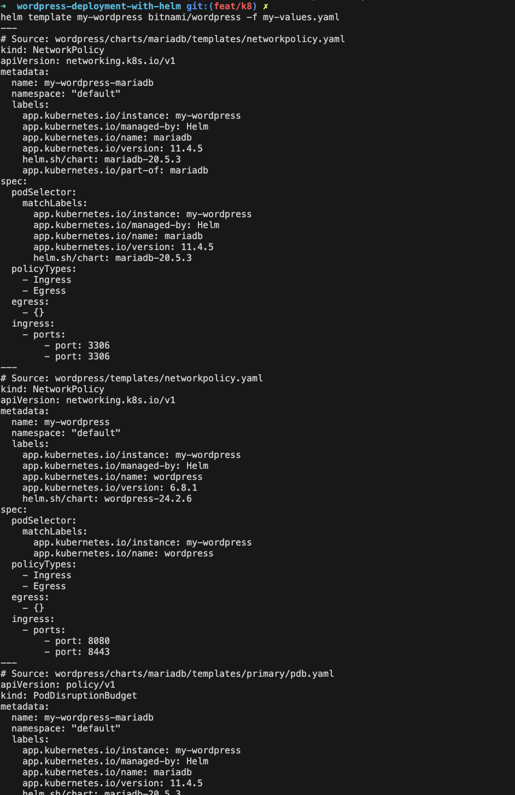

### Checking for Values Errors

To verify your values file doesn't have any syntax errors:

```bash
helm lint wordpress -f my-values.yaml
```

### Values Customization Diagram

```
┌───────────────────┐     ┌───────────────────┐     ┌───────────────────┐
│                   │     │                   │     │                   │
│ Default values.   │     │ Your custom       │     │ Command line      │
│ yaml from chart   │     │ values.yaml file  │     │ --set parameters  │
│                   │     │                   │     │                   │
└─────────┬─────────┘     └─────────┬─────────┘     └─────────┬─────────┘
          │                         │                         │
          ▼                         ▼                         ▼
┌─────────────────────────────────────────────────────────────────────────┐
│                                                                         │
│                         Values Merge Process                            │
│                                                                         │
└─────────────────────────────────────┬───────────────────────────────────┘
                                      │
                                      ▼
┌─────────────────────────────────────────────────────────────────────────┐
│                                                                         │
│                     Chart Templates + Merged Values                     │
│                                                                         │
└─────────────────────────────────────┬───────────────────────────────────┘
                                      │
                                      ▼
┌─────────────────────────────────────────────────────────────────────────┐
│                                                                         │
│              Final Kubernetes Resource Manifests (YAML)                 │
│                                                                         │
└─────────────────────────────────────────────────────────────────────────┘
```

## Installing the WordPress Chart

Once you've prepared your values file, you can proceed with the installation. This section covers various installation approaches. you can choose the one that best fits your needs.

### 1. Basic Installation

The simplest installation uses default values:

```bash
helm install my-wordpress bitnami/wordpress
```

This creates a release named "my-wordpress" using the Bitnami WordPress chart with default configuration values.

### 2. Installation with Custom Values

To use your custom values file:

```bash
helm install my-wordpress bitnami/wordpress -f my-values.yaml
```

### 3. Installation with Namespace

In Kubernetes, namespaces provide isolation between groups of resources. It's good practice to install WordPress in its own namespace:

```bash
helm install my-wordpress bitnami/wordpress -f my-values.yaml --namespace wordpress --create-namespace
```

The `--create-namespace` flag creates the namespace if it doesn't exist yet.

### 4. Installation with Values Set via Command Line

For quick customizations without creating a values file:

```bash
helm install my-wordpress bitnami/wordpress \
  --set wordpressUsername=admin \
  --set wordpressPassword=password \
  --set mariadb.auth.rootPassword=secretpassword
```

You can combine `--set` with values files. Command-line values take precedence over those in the file:

```bash
helm install my-wordpress bitnami/wordpress -f my-values.yaml \
  --set wordpressBlogName="My Production Blog"
```

### 5. Dry Run Installation

To see what would be installed without actually installing:

```bash
helm install my-wordpress bitnami/wordpress -f my-values.yaml --dry-run
```

This outputs the Kubernetes manifests that would be applied.

For more verbose output:

```bash
helm install my-wordpress bitnami/wordpress -f my-values.yaml --dry-run --debug
```

### 6. Installation with Wait

To wait until all resources are in a ready state before completing:

```bash
helm install my-wordpress bitnami/wordpress -f my-values.yaml --wait
```

### Installation Flow Diagram

```
┌─────────────────────────────────────────────────────────────────────────┐
│                           Installation Process                          │
└─────────────────────────────────────────────────────────────────────────┘
                                    │
           ┌──────────────┬─────────┴────────────┬──────────────┐
           │              │                      │              │
           ▼              ▼                      ▼              ▼
┌──────────────────┐ ┌──────────────┐  ┌──────────────────┐ ┌──────────────┐
│                  │ │              │  │                  │ │              │
│ Process Values   │ │  Render      │  │  Install Chart   │ │  Run Hooks   │
│ and Dependencies │ │  Templates   │  │  Resources       │ │              │
│                  │ │              │  │                  │ │              │
└──────────┬───────┘ └──────┬───────┘  └──────────┬───────┘ └──────┬───────┘
           │              │                      │                 │
           ▼              ▼                      ▼                 ▼
┌──────────────────┐ ┌──────────────┐  ┌──────────────────┐ ┌──────────────┐
│                  │ │              │  │                  │ │              │
│ Validate Chart   │ │ Create K8s   │  │ Wait for         │ │ Display      │
│ Requirements     │ │ Manifests    │  │ Resources        │ │ NOTES.txt    │
│                  │ │              │  │                  │ │              │
└──────────────────┘ └──────────────┘  └──────────────────┘ └──────────────┘

                                     ┌──────────────────┐
                                     │                  │
                                     │  Final Release   │
                                     │                  │
                                     └──────────────────┘
```

### What Happens When You Install a Chart

When you run `helm install`, several steps occur:

1. Values files are merged with default values
2. Dependencies are processed
3. Templates are rendered into Kubernetes manifests
4. Kubernetes validation is performed
5. Pre-install hooks are executed
6. Chart resources are applied to the cluster
7. Post-install hooks are executed
8. Release name and information are stored
9. Installation notes are displayed

### Post-Installation Output

After installing WordPress, you'll see output like:

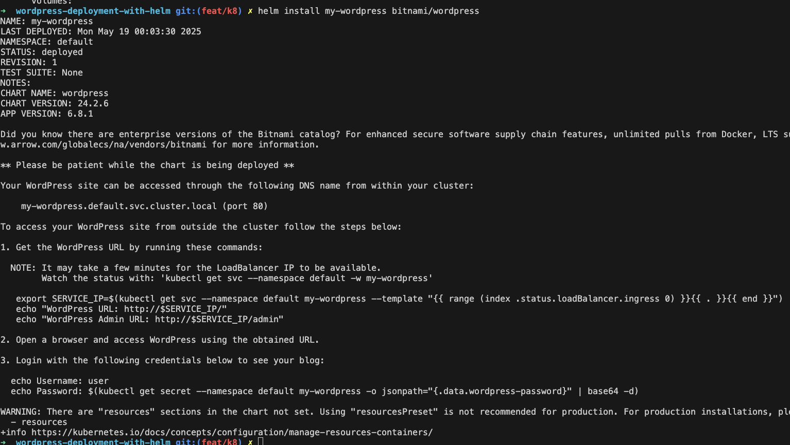


```zsh
NAME: my-wordpress
LAST DEPLOYED: Sun May 18 12:34:56 2025
NAMESPACE: wordpress
STATUS: deployed
REVISION: 1
NOTES:
** Please be patient while the chart is being deployed **

Your WordPress site can be accessed through the following DNS name from within your cluster:

    my-wordpress.wordpress.svc.cluster.local (port 80)

To access your WordPress site from outside the cluster follow the steps below:

1. Get the WordPress URL by running these commands:

   export SERVICE_PORT=$(kubectl get --namespace wordpress -o jsonpath="{.spec.ports[0].port}" services my-wordpress)
   kubectl port-forward --namespace wordpress svc/my-wordpress ${SERVICE_PORT}:${SERVICE_PORT} &
   echo "WordPress URL: http://127.0.0.1:${SERVICE_PORT}/"
   echo "WordPress Admin URL: http://127.0.0.1:${SERVICE_PORT}/admin"

2. Open a browser and access WordPress using the obtained URL.

3. Login with the following credentials below to see your site:

  echo Username: admin
  echo Password: $(kubectl get secret --namespace wordpress my-wordpress -o jsonpath="{.data.wordpress-password}" | base64 -d)
```

## Accessing WordPress

By running the `helm status` command, you can see the status of your WordPress deployment and the URL to access it.

```bash
helm status my-wordpress
```
This will show you the service details, including the external IP or port to access WordPress.

Also you can use the service external IP for Loadbalncer service type. you can use the following command to get the service details:

```bash
kubectl get svc
```

For `kind` users, you can access WordPress using port forwarding since `kind` doesn't provide an external IP by default:

```bash
  kubectl port-forward svc/my-wordpress 8080:80
```

Then, open your browser and navigate to `http://localhost:8080`.

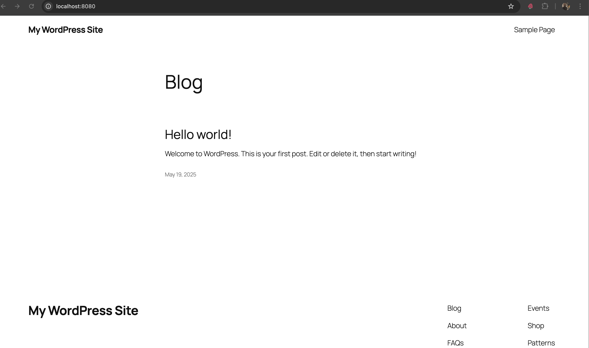

### Accessing WordPress Admin
To access the WordPress admin panel, go to `http://localhost:8080/wp-admin` and log in with the credentials you set in your values file or the default ones provided by the chart.

To retrieve the default credentials, you can use:

```bash
echo Username: admin
echo Password: $(kubectl get secret --namespace wordpress my-wordpress -o jsonpath="{.data.wordpress-password}" | base64 --decode)
```

This will output the default username and password for WordPress.

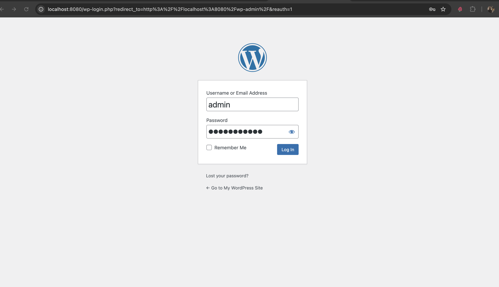

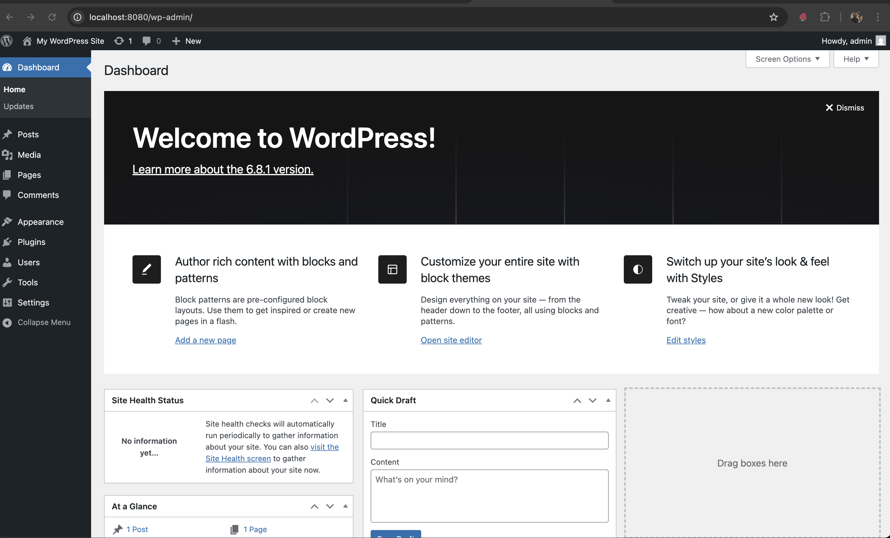

## Managing Helm Releases

### Listing Releases

```bash
# List all releases in the current namespace
helm list

# List all releases in all namespaces
helm list --all-namespaces

# List releases in a specific namespace
helm list --namespace wordpress
```

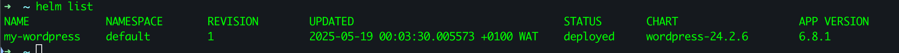

### Checking Release Status

```bash
helm status my-wordpress
```

### Viewing Release Information

```bash
helm get all my-wordpress
```

### Getting Release Values

```bash
helm get values my-wordpress
```

### Getting Release Manifests

```bash
helm get manifest my-wordpress
```

## Upgrading WordPress

### Upgrading a Release

After modifying your values file:

```bash
helm upgrade my-wordpress bitnami/wordpress -f my-values.yaml
```

### Upgrading and Installing if Not Present

```bash
helm upgrade --install my-wordpress bitnami/wordpress -f my-values.yaml
```

### Rollback to a Previous Release

If an upgrade causes issues:

```bash
# List release history
helm history my-wordpress

# Rollback to a specific revision (e.g., revision 1)
helm rollback my-wordpress 1
```

## Uninstalling WordPress

### Basic Uninstallation

```bash
helm uninstall my-wordpress
```

### Uninstall with Namespace Specification

```bash
helm uninstall my-wordpress --namespace wordpress
```

## Working with WordPress Post-Installation

After installing WordPress, you'll need to get the application URL and login credentials.

### Getting WordPress URL

In your kubernetes cluster, the WordPress service is created. To access it, you can use:

```bash
kubectl get svc
```

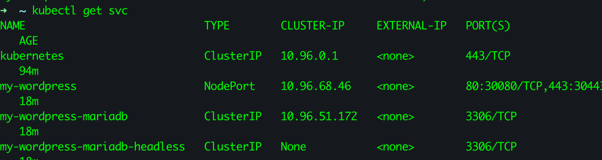

```bash
kubectl get svc my-wordpress
```

This will show you the service details, including the external IP or port to access WordPress.

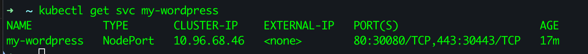

To see all services running in the `wordpress` namespace:

```bash
kubectl get svc --namespace wordpress
```
This will show you the service details, including the external IP or port to access WordPress.


### Retrieving WordPress Credentials

If you didn't set credentials in your values file, Helm may have generated them:

```bash
echo Username: user
echo Password: $(kubectl get secret --namespace wordpress my-wordpress -o jsonpath="{.data.wordpress-password}" | base64 --decode)
```

## Advanced Helm Commands

### Downloading a Chart

```bash
helm pull bitnami/wordpress --untar
```

This allows you to examine and modify the chart before installation.

### Creating a Chart Package

After modifying a chart:

```bash
helm package ./wordpress
```

### Linting a Chart

Check a chart for issues:

```bash
helm lint ./wordpress
```

### Generating Release Name

If you want Helm to generate a release name:

```bash
helm install bitnami/wordpress --generate-name
```

## Using Helm Plugins

Helm's functionality can be extended with plugins:

### Installing the Diff Plugin

The diff plugin shows what changes an upgrade would make:

```bash
helm plugin install https://github.com/databus23/helm-diff
```

### Using the Diff Plugin

```bash
# Preview changes an upgrade would make
helm diff upgrade my-wordpress bitnami/wordpress -f my-values.yaml
```

## Helm Hooks

Helm charts can use hooks for lifecycle management. Common hooks include:

- pre-install
- post-install
- pre-delete
- post-delete
- pre-upgrade
- post-upgrade
- pre-rollback
- post-rollback

## Debugging Helm Chart Issues

### Debugging Installation

```bash
helm install my-wordpress bitnami/wordpress -f my-values.yaml --debug
```

### Testing Chart Rendering

```bash
helm template my-wordpress bitnami/wordpress -f my-values.yaml --debug
```

### Viewing Events After Installation

```bash
kubectl get events --namespace wordpress
```

## Common Issues and Solutions

### PVC Pending

If WordPress doesn't start because Persistent Volume Claims are stuck in "Pending":
- Ensure your cluster has a storage class configured
- Check storage provisioner availability

```bash
kubectl get pvc --namespace wordpress
kubectl describe pvc data-my-wordpress-mariadb-0 --namespace wordpress
```

### Pod Status Issues

If pods are not reaching "Running" state:

```bash
kubectl get pods --namespace wordpress
kubectl describe pod my-wordpress-xxxx --namespace wordpress
```

### Service Connection Issues

If you cannot access WordPress:

```bash
kubectl get svc --namespace wordpress
kubectl describe svc my-wordpress --namespace wordpress
```

## Best Practices for Working with Helm Charts

1. **Always use version control** for your values files
2. **Use descriptive release names** for better management
3. **Namespace your releases** to organize applications
4. **Use `--dry-run` before actual installation** to validate configurations
5. **Use the diff plugin** to understand changes before upgrades
6. **Always back up important data** before major upgrades
7. **Use helm test capabilities** when available

## Conclusion

This README has covered the basics of working with the Bitnami WordPress Helm chart and essential Helm commands. By exploring these commands and concepts, you'll gain valuable experience with Helm that can be applied to any chart, not just WordPress.

For more information, visit:
- [Helm Documentation](https://helm.sh/docs/)
- [Bitnami WordPress Chart Documentation](https://github.com/bitnami/charts/tree/master/bitnami/wordpress)
