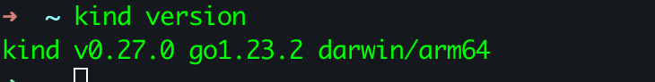

# Installing and setting up Kind (Kubernetes in Docker)

This README provides comprehensive instructions for installing Kind, a tool that lets you run Kubernetes clusters using Docker containers as nodes.

## What is Kind?

Kind (Kubernetes IN Docker) is a tool for running local Kubernetes clusters using Docker containers as "nodes." It was primarily designed for testing Kubernetes itself, but is perfect for local development and CI.

## Prerequisites

- **Docker**: Kind requires Docker to be installed and running
- **Administrative permissions** for installing binaries

## Installation Methods

### Method 1: Using Package Managers

#### macOS (using Homebrew)
```bash
brew install kind
```

#### Windows (using Chocolatey)
```bash
choco install kind
```

#### Windows (using Scoop)
```bash
scoop install kind
```

### Method 2: Using Binary Release

#### Linux/macOS

```bash
# For AMD64 / x86_64
[ $(uname -m) = x86_64 ] && curl -Lo ./kind https://kind.sigs.k8s.io/dl/v0.28.0/kind-linux-amd64

# For ARM64
[ $(uname -m) = aarch64 ] && curl -Lo ./kind https://kind.sigs.k8s.io/dl/v0.28.0/kind-linux-arm64

# Make the binary executable
chmod +x ./kind

# Move it to a location in your PATH
sudo mv ./kind /usr/local/bin/kind
```

#### Windows (PowerShell)
```powershell
# For AMD64 / x86_64
curl.exe -Lo kind-windows-amd64.exe https://kind.sigs.k8s.io/dl/v0.20.0/kind-windows-amd64

# Move to a directory in your PATH
Move-Item .\kind-windows-amd64.exe c:\some-dir-in-your-PATH\kind.exe
```

### Method 3: Using Go

If you have Go 1.17+ installed:

```bash
go install sigs.k8s.io/kind@v0.20.0
```

## Verifying the Installation

Verify that Kind was installed correctly:

```bash
kind version
```



You should see output similar to:
```
kind v0.20.0 go1.19.10 linux/amd64
```

## Basic Usage

### Creating a Cluster

Create a default cluster:

```bash
kind create cluster
```

This command:
1. Creates a cluster named "kind"
2. Configures your kubectl to use this cluster
3. Sets up a single-node Kubernetes environment

### Creating a Cluster with a Custom Name

```bash
kind create cluster --name my-cluster
```

### Creating a Multi-node Cluster

1. Create a configuration file named `multi-node.yaml`:

```yaml
kind: Cluster
apiVersion: kind.x-k8s.io/v1alpha4
nodes:
  - role: control-plane
  - role: worker
  - role: worker
```

2. Create the cluster with this configuration:

```bash
  kind create cluster --config multi-node.yaml --name multi-node-cluster
```

### Deleting a Cluster

```bash
  kind delete cluster --name my-cluster
```

### Listing Clusters

```bash
  kind get clusters
```

## Configuration Options

Kind supports extensive configuration through YAML files. Some common options include:

- Multiple nodes (control-plane and workers)
- Custom container image
- Port mappings
- Volume mounts
- Registry configuration

Example of a more detailed configuration:

```yaml
kind: Cluster
apiVersion: kind.x-k8s.io/v1alpha4
nodes:
- role: control-plane
  kubeadmConfigPatches:
  - |
    kind: InitConfiguration
    nodeRegistration:
      kubeletExtraArgs:
        node-labels: "ingress-ready=true"
        authorization-mode: "AlwaysAllow"
  extraPortMappings:
  - containerPort: 80
    hostPort: 80
    protocol: TCP
  - containerPort: 443
    hostPort: 443
    protocol: TCP
- role: worker
- role: worker
networking:
  apiServerAddress: "127.0.0.1"
  apiServerPort: 6443
```

## Docker Resource Requirements

For running Kind effectively, ensure Docker has:
- At least 6GB of RAM allocated
- At least 2 CPU cores
- At least 20GB of free disk space

## Troubleshooting

### Common Issues

#### Docker Not Running
Ensure Docker is running before using Kind:
```bash
  docker info
```

#### Insufficient Resources
If clusters fail to start or have stability issues, increase Docker's resource limits.

#### Network Port Conflicts
If you see port binding errors, ensure the required ports (80, 443, 6443, etc.) are not already in use.

#### Permission Issues
On Linux, ensure your user is in the docker group:
```bash
  sudo usermod -aG docker $USER
  newgrp docker
```

## Additional Resources

- [Kind Documentation](https://kind.sigs.k8s.io/docs/user/quick-start/)

## Version Compatibility

As of this writing, Kind v0.20.0 supports Kubernetes versions up to 1.27. Check the [Kind releases page](https://github.com/kubernetes-sigs/kind/releases) for the latest version information.
